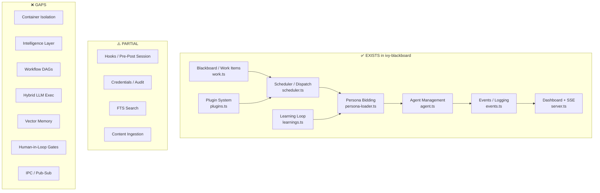

# NanoClaw Product Specification

## Overview
NanoClaw is a lightweight, secure AI agent framework that runs agents in isolated containers (Docker or Apple Container) for enhanced security. It serves as a personal assistant connecting to messaging apps like WhatsApp, Telegram, Slack, Discord, and Gmail. Built in TypeScript, it emphasizes minimalism with a small, auditable codebase (~4,000 lines), persistent memory, scheduled tasks, and agent swarms. It's designed for easy customization, making it ideal for building a flexible system that interfaces with any LLM via API endpoint swaps.

## Key Features
- Isolated agent execution in containers for security.
- Multi-channel messaging integrations (extendable via skills).
- Persistent per-group memory using SQLite.
- Scheduled/recurring tasks (cron-like).
- Agent swarms for collaborative task handling.
- Web access and browser automation.
- Skills system for dynamic extensions (e.g., add new channels or tools).

## Architecture
- Single orchestrator process handling message flow.
- Channels register dynamically; messages route through SQLite queues to containerized agents.
- IPC via filesystem; concurrency managed per group.
- Modular components: container runner, task scheduler, database handler.

## LLM Integration
NanoClaw is natively built on Anthropic's Claude Agents SDK but supports any Claude API-compatible LLM endpoint. To connect to any LLM:
- Set `ANTHROPIC_BASE_URL` and `ANTHROPIC_AUTH_TOKEN` in `.env` to point to your preferred endpoint (e.g., Ollama proxy for local models, Together AI for open-source alternatives).
- Use the `/add-ollama` skill for local inference setup.
- For non-compatible LLMs, fork and modify the SDK integration in `src/index.ts` to use an OpenAI-style wrapper, ensuring the model supports function/tool calling.

## Dependencies
- Node.js 20+.
- Claude Code CLI.
- Docker (or Apple Container on macOS).
- SQLite (embedded).
- TypeScript for development.

## Setup/Build Instructions
1. Clone: `git clone https://github.com/qwibitai/nanoclaw.git && cd nanoclaw`.
2. Run `claude` (Claude Code CLI).
3. Execute `/setup` for AI-guided installation (handles deps, auth, containers).
4. Build custom: Modify code via Claude Code (e.g., "Add support for Grok API"), then restart.

## Tools/Skills System
- Core tools: Web browsing, file system access, shell execution, memory management, scheduling.
- Skills: Markdown-based extensions in `.claude/skills/` (e.g., `/add-gmail`); apply via CLI to add features without core changes.

## Customization Notes
- No config files; customize via natural language instructions to Claude Code (e.g., change triggers or add LLM wrappers).
- For any LLM, prioritize API-compatible endpoints; extend skills to handle model-specific prompts.

# PicoClaw Product Specification

## Overview
PicoClaw is an ultra-efficient Go-based AI agent framework optimized for tiny hardware (e.g., $10 boards like Raspberry Pi Zero). It focuses on low resource use (<10MB RAM, <1s startup), sandboxed execution, and multi-channel support. AI-bootstrapped with human refinements, it's perfect for building edge-deployable assistants that connect to any LLM via flexible config.

## Key Features
- Extreme efficiency for low-power devices.
- Sandboxed tools restricted to workspace.
- Multi-channel: Telegram, Discord, WhatsApp, QQ, etc.
- Web search integrations (DuckDuckGo, Brave, Tavily).
- Heartbeat for periodic tasks.
- Security blocks on dangerous commands.

## Architecture
- Modular CLI tools: agent, gateway, onboard.
- Shared HTTP gateway for webhooks.
- Workspace for sessions, memory, skills.
- Sandbox limits file/command access.

## LLM Integration
PicoClaw is model-agnostic using OpenAI-compatible APIs. To connect to any LLM:
- Add to `model_list` in `~/.picoclaw/config.json` (e.g., vendor prefix like `openai/`, `ollama/`, or custom `api_base`).
- Assign to agents in config (e.g., fallback to multiple providers).
- For local models, use `ollama/` or `vllm/` prefixes; no key needed for localhost.

## Dependencies
- Go (for building).
- Docker (optional for deployment).
- API keys for LLMs/channels.

## Setup/Build Instructions
1. Clone: `git clone https://github.com/sipeed/picoclaw.git && cd picoclaw`.
2. Build: `make build` (or `make build-pi-zero` for specific hardware).
3. Install: `make install`.
4. Onboard: `picoclaw onboard`.
5. Docker: `docker compose up`.

## Tools/Skills System
- Built-in: File ops, exec (sandboxed), web search, spawn subagents, messaging.
- Skills: Load from workspace directories; configure tools in JSON.

## Customization Notes
- Override paths via env vars; add skills to `skills/`.
- For any LLM, extend `model_list`—supports proxies like LiteLLM for broad compatibility.

# ZeroClaw Product Specification

## Overview
ZeroClaw is a Rust-based autonomous AI assistant infrastructure emphasizing zero overhead, high efficiency, and full component swappability. It runs on cheap hardware with minimal resources (<5MB RAM, <10ms startup) and abstracts models/tools/memory for portable agent workflows. Ideal for building modular systems that swap LLMs seamlessly.

## Key Features
- Low-footprint runtime for edge devices.
- Secure sandboxing with allowlists.
- Research-phase fact-checking.
- Portable across architectures (ARM, x86, RISC-V).
- No vendor lock-in.

## Architecture
- Trait-driven modularity for providers/channels/tools.
- Pluggable memory and execution.
- Single-binary runtime; daemon/CLI modes.

## LLM Integration
Fully agnostic via traits; supports any OpenAI-compatible endpoint. To connect to any LLM:
- Implement provider trait in code (e.g., custom endpoint URL/auth).
- Configure via env vars or traits; swap at runtime.
- No hardcoded models—build once, deploy with any backend.

## Dependencies
- Rust toolchain.
- Nix (optional for builds).

## Setup/Build Instructions
1. Clone: `git clone https://github.com/zeroclaw-labs/zeroclaw.git`.
2. Build: `cargo build --release`.
3. Bootstrap: `./bootstrap.sh`.
4. Docker: Use `docker-compose.yml`.

## Tools/Skills System
- Pluggable via traits; skills in `/skills/` with domain policies.
- Core: Research/execution tools.

## Customization Notes
- Trait-based—add any LLM by implementing provider trait; highly extensible for custom integrations.

# IronClaw Product Specification

## Overview
IronClaw is a Rust-based, privacy-focused AI assistant inspired by OpenClaw, with WASM sandboxing and credential protection. It supports multi-channel interactions, dynamic tools, and hybrid memory. Suited for secure builds that integrate any LLM via OpenAI-compatible endpoints.

## Key Features
- WASM sandboxing for tools.
- Multi-channel: REPL, HTTP, Telegram/Slack.
- Hybrid memory (text + vector).
- Routines for schedules/triggers.
- Self-repair and parallel jobs.

## Architecture
- Core loop: Agent, router, scheduler, worker, orchestrator.
- Channels feed into loop; tools via registry (built-in/MCP/WASM).

## LLM Integration
Defaults to NEAR AI but supports any OpenAI-compatible. To connect to any LLM:
- Set `LLM_BACKEND=openai_compatible`, `LLM_BASE_URL`, `LLM_API_KEY`, `LLM_MODEL` in `.env`.
- Use OpenRouter for 300+ models; local via Ollama/vLLM.

## Dependencies
- Rust 1.85+.
- PostgreSQL 15+ with pgvector.
- Docker (optional).

## Setup/Build Instructions
1. Clone: `git clone https://github.com/nearai/ironclaw.git`.
2. Build: `cargo build --release`.
3. DB: `createdb ironclaw; psql ironclaw -c "CREATE EXTENSION vector;"`.
4. Onboard: `ironclaw onboard`.

## Tools/Skills System
- Registry for built-in/MCP/WASM tools.
- Dynamic building: Describe tools for auto-WASM creation.
- Skills in `skills/`.

## Customization Notes
- Plugin architecture for new tools/channels; switch LLMs via env vars.

# TinyClaw Product Specification

## Overview
TinyClaw is a multi-agent framework for collaborative AI teams, with isolated workspaces and multi-channel support (Discord, WhatsApp, Telegram). It uses CLI tools for LLM access and includes a web dashboard (TinyOffice). Great for building team-based systems extensible to any LLM via wrappers.

## Key Features
- Multi-agent teams with chain/fan-out.
- Multi-channel and web dashboard.
- Persistent sessions; heartbeat check-ins.
- SQLite queue for reliable messaging.

## Architecture
- Message enqueue to SQLite; processor assigns to agents.
- Per-agent isolation in workspaces.
- Parallel processing with order preservation.

## LLM Integration
CLI-based (Claude Code, Codex). To connect to any LLM:
- Create CLI wrapper (stdin input, stdout output) for your model.
- Add provider in `settings.json`; modify src to invoke wrapper.
- Use plugins to intercept and route to custom LLMs.

## Dependencies
- Node.js v18+, Bash, tmux, jq.
- LLM CLIs (Anthropic/OpenAI).

## Setup/Build Instructions
1. Clone: `git clone https://github.com/TinyAGI/tinyclaw.git`.
2. Install: `npm install; ./scripts/install.sh`.
3. Start: `tinyclaw start` (wizard setup).
4. Dashboard: `cd tinyoffice; npm run dev`.

## Tools/Skills System
- Agents/teams configured in JSON.
- Skills in `.agents/skills/`; admin commands in-chat.

## Customization Notes
- Plugin system for LLM hooks; extend via CLI wrappers for any model.

# Nanobot Product Specification

## Overview
Nanobot is a Python-based ultra-lightweight AI assistant (~4,000 lines) with clean architecture for research/extensibility. It supports multi-channel chats and MCP for tools, making it easy to build prototypes connecting to any LLM.

## Key Features
- Lightweight core; multi-channel (Telegram, Discord, etc.).
- MCP for external tools.
- Heartbeat scheduling.
- Security whitelists.

## Architecture
- Modules: agent (loop/memory), channels, providers, tools, session.
- Config-driven; bus for routing.

## LLM Integration
Provider registry for easy additions. To connect to any LLM:
- Add to `config.json` (e.g., custom `apiBase` for OpenAI-compatible).
- Use vLLM for local; OpenRouter for broad access.
- Extend registry in `providers/registry.py` for new ones.

## Dependencies
- Python; optional for channels (e.g., Matrix).

## Setup/Build Instructions
1. Clone: `git clone https://github.com/HKUDS/nanobot.git`.
2. Install: `pip install -e .`.
3. Onboard: `nanobot onboard`.
4. Run: `nanobot agent` or `nanobot gateway`.

## Tools/Skills System
- Built-in: Shell/file ops.
- MCP: Connect external servers.
- Skills: Bundled in `skills/`; auto-install from hubs.

## Customization Notes
- Add providers in two steps; MCP for tool extensibility—perfect for custom LLM integrations.

# Consolidated List of Unique Skills to Create an AI Operating System

Building an AI Operating System (AI OS)—a platform that integrates AI for managing workloads, automating tasks, and enabling intelligent operations (e.g., like Red Hat's AI OS or conceptual systems from Uber's Michelangelo)—requires a blend of technical, architectural, and operational skills. Based on industry insights from sources like Red Hat, IBM, and AI infrastructure guides, I've consolidated a unique list of essential skills. These are categorized for clarity, focusing on human expertise needed to design, develop, and deploy such a system. Duplicates have been removed, and the list emphasizes practical, non-overlapping competencies.

## 1. **Programming and Development Skills**
   - Proficiency in core languages: Python (for AI libraries), Java (for scalable systems), C++ (for performance-critical components), and R (for statistical analysis).
   - Advanced system architecture: Designing modular, scalable systems with containerization (e.g., Docker) and efficient resource management.
   - Version control: Using Git/GitHub for collaborative code management and tracking changes in AI projects.
   - API integration and authentication: Building and securing APIs to connect the AI OS with external tools, databases, and third-party systems.

## 2. **Machine Learning and AI Expertise**
   - Machine learning fundamentals: Supervised, unsupervised, and reinforcement learning; algorithm selection and optimization.
   - Deep learning: Building and training neural networks, including large language models (LLMs) and generative AI.
   - Model lifecycle management: Training, evaluation, deployment, and updating models using frameworks like TensorFlow, PyTorch, or Keras.
   - Domain-specific AI: Customizing models for tasks like natural language processing (NLP), computer vision, or predictive analytics.

## 3. **Data Management and Processing Skills**
   - Data structures and algorithms: Efficient handling of large datasets, reducing computational overhead, and improving AI performance.
   - Data pipeline engineering: Creating scalable pipelines for data ingestion, processing, storage, and governance (e.g., ensuring compliance and quality).
   - Big data handling: Working with tools for massive datasets, including integration with knowledge bases for AI decision-making.

## 4. **Infrastructure and Operations Skills**
   - Hardware optimization: Knowledge of accelerated compute like GPUs/TPUs for training/inference, and heterogeneous accelerators.
   - Orchestration and scaling: Using Kubernetes for distributed AI workloads, multi-tenancy, and reliable deployment.
   - Inference runtime expertise: Implementing kernels like vLLM for efficient model execution at scale.
   - Security and compliance: Designing zero-trust frameworks, prompt injection defenses, and data privacy measures.

## 5. **Strategic and Soft Skills**
   - Talent and team management: Assessing skills gaps, building teams (e.g., data scientists, developers), and deciding on outsourcing.
   - Business alignment: Understanding organizational priorities, identifying AI use cases, and integrating with existing IT infrastructure.
   - Self-optimization techniques: Enabling the AI OS to learn from user behavior and automate system improvements.

This list draws from best practices in building production-grade AI systems, emphasizing open-source technologies like Kubernetes and vLLM for cost-effective scalability. If you're a beginner, start with Python and ML basics; for enterprises, focus on orchestration and security. Total unique skills: ~20, prioritized by frequency across sources.

# Consolidated Catalog of Unique Skills for an AI Operating System

Based on the Claw family frameworks (NanoClaw, PicoClaw, ZeroClaw, IronClaw, TinyClaw, Nanobot), I've consolidated a unique list of skills, tools, features, and extensions mentioned across their documentation. These form the building blocks for an AI Operating System (AI OS)—a platform for autonomous agents handling tasks, integrations, security, and automation. Duplicates have been removed (e.g., overlapping "spawn" or "heartbeat" implementations are unified with cross-references). 

The list is categorized for clarity. For each unique skill/tool/function:
- **Description**: What it performs.
- **Supporting Tool Names**: The underlying tool(s) or function calls that implement or support it (e.g., API endpoints, commands, or SDK integrations).
- **Range of Parameters**: Parameters with names, types, required/optional status, descriptions, and supported ranges/examples where documented. If no parameters are specified in sources, it's noted.

This catalog focuses on agent-usable or extensible capabilities. ZeroClaw and TinyClaw provided no extractable details, so they're excluded.

## 1. **File System and Storage Skills**
   - **Filesystem Operations**  
     **Description**: Read, write, list, edit, append, and manage files/directories in a workspace or isolated storage.  
     **Supporting Tool Names**: `read_file`, `write_file`, `list_dir`, `edit_file`, `append_file`, `filesystem` (MCP server).  
     **Range of Parameters**:  
       - `path` (string, required): File/directory path within workspace (e.g., relative to `~/.picoclaw/workspace` or `/path/to/dir`).  
       - `content` (string, required for write/edit/append): Content to write or append.  
       - `command` (string, required for MCP): "npx" or similar for server launch.  
       - `args` (array of strings, required for MCP): e.g., ["-y", "-@modelcontextprotocol/server-filesystem", "/path/to/dir"].  
       - Supported Ranges/Examples: Restricted to workspace if `restrictToWorkspace: true`; examples: `read_file(path="notes.txt")`.

   - **Workspace Filesystem**  
     **Description**: Flexible path-based storage for notes, logs, and context.  
     **Supporting Tool Names**: `workspace_filesystem`.  
     **Range of Parameters**: None specified.

   - **Identity Files**  
     **Description**: Maintain consistent personality/preferences across sessions.  
     **Supporting Tool Names**: `identity_files`.  
     **Range of Parameters**: None specified.

   - **PostgreSQL with pgvector**  
     **Description**: Local database storage with vector support for embeddings.  
     **Supporting Tool Names**: `postgresql_pgvector`.  
     **Range of Parameters**: Requires SQL extension (e.g., `CREATE EXTENSION vector;`). No other params.

## 2. **Execution and Command Skills**
   - **Shell/Command Execution**  
     **Description**: Execute shell commands or scripts in a sandboxed environment.  
     **Supporting Tool Names**: `exec`, `spawn` (for subprocesses).  
     **Range of Parameters**:  
       - `command` (string, required): Command to run (e.g., "ls -la").  
       - `tools.exec.pathAppend` (string, optional): Extra PATH directories.  
       - Supported Ranges/Examples: Blocked commands (e.g., `rm -rf`, `shutdown`); restricted to workspace if enabled. Examples: `exec(command="git pull")`.

   - **Code Execution/Interpreter**  
     **Description**: Run code snippets (e.g., Python/JS) or debug.  
     **Supporting Tool Names**: `subagent` (for background execution).  
     **Range of Parameters**: None specified; internal to agent loop.

   - **Dynamic Tool Building**  
     **Description**: Build new tools dynamically from user descriptions (e.g., as WASM).  
     **Supporting Tool Names**: `dynamic_tool_building`.  
     **Range of Parameters**: None specified.

## 3. **Search and Access Skills**
   - **Web Access/Search**  
     **Description**: Search the web, fetch content, or integrate providers like DuckDuckGo.  
     **Supporting Tool Names**: `web_search`, `duckduckgo`, `brave`, `tavily`.  
     **Range of Parameters**:  
       - `enabled` (bool, required): Enable provider (default: true for DuckDuckGo).  
       - `api_key` (string, required for Brave/Tavily): API key.  
       - `max_results` (integer, optional): Max results (default: 5; range: 1–unlimited based on API limits).  
       - Supported Ranges/Examples: Brave: 2000 free queries/month; Tavily: 1000/month free. Examples: `brave(enabled=true, api_key="sk-...")`.

   - **Hybrid Search**  
     **Description**: Full-text and vector search with rank fusion.  
     **Supporting Tool Names**: `hybrid_search`.  
     **Range of Parameters**: None specified.

   - **X/Twitter Integration**  
     **Description**: Search posts, interact with Twitter/X (not explicitly detailed but implied in skills).  
     **Supporting Tool Names**: None specific; overlaps with web_search.  
     **Range of Parameters**: N/A.

## 4. **Messaging and Channel Integration Skills**
   - **Messaging/Channel Integrations**  
     **Description**: Send/receive messages via apps like WhatsApp, Telegram, etc.  
     **Supporting Tool Names**: `telegram`, `discord`, `whatsapp`, `qq`, `dingtalk`, `line`, `wecom`, `wecom_app`, `wecom_aibot`, `message` (for subagents), `/add-whatsapp`, `/add-telegram`, `/add-gmail`.  
     **Range of Parameters**:  
       - `enabled` (bool, required): Enable channel (default: false).  
       - `token` (string, required): Bot/API token (e.g., from @BotFather for Telegram).  
       - `allow_from` (array of strings, optional): Allowed user IDs (empty for all).  
       - `bridge_url` (string, optional for WhatsApp): WebSocket bridge.  
       - `webhook_path` (string, optional): e.g., "/webhook/line" (default varies).  
       - `welcome_message` (string, optional for WeCom AI): Initial message.  
       - Supported Ranges/Examples: Telegram: `allow_from=["123456789"]`; WhatsApp: QR scan for native; ranges: User IDs as strings.

   - **REPL (Read-Eval-Print Loop)**  
     **Description**: Interactive CLI for direct interaction.  
     **Supporting Tool Names**: `repl`.  
     **Range of Parameters**: None specified.

   - **HTTP Webhooks**  
     **Description**: Handle external requests.  
     **Supporting Tool Names**: `http_webhooks`.  
     **Range of Parameters**: None specified.

   - **Web Gateway**  
     **Description**: Browser UI with real-time streaming.  
     **Supporting Tool Names**: `web_gateway`.  
     **Range of Parameters**: None specified.

   - **WASM Channels**  
     **Description**: Integrate platforms like Telegram/Slack via WASM.  
     **Supporting Tool Names**: `wasm_channels`.  
     **Range of Parameters**: None specified.

## 5. **Scheduling and Automation Skills**
   - **Scheduled/Recurring Tasks**  
     **Description**: Run jobs on timers, cron, or heartbeats.  
     **Supporting Tool Names**: `cron`, `heartbeat`, `routines_engine`, `scheduler`, `HEARTBEAT.md`.  
     **Range of Parameters**:  
       - `enabled` (bool, optional): Enable (default: true).  
       - `interval` (integer, optional): Minutes between checks (default: 30; min: 5).  
       - Cron expressions (string, required for cron): e.g., "0 9 * * *" (at 9am daily).  
       - Supported Ranges/Examples: One-time: "in 10 minutes"; recurring: "every 2 hours". File-based: Markdown checklists in `HEARTBEAT.md`.

   - **Heartbeat System**  
     **Description**: Proactive background execution.  
     **Supporting Tool Names**: `heartbeat_system`.  
     **Range of Parameters**: None specified.

   - **Self-Repair**  
     **Description**: Detect and recover stuck operations.  
     **Supporting Tool Names**: `self_repair`.  
     **Range of Parameters**: None specified.

## 6. **Agent Management and Collaboration Skills**
   - **Agent Swarms/Teams**  
     **Description**: Collaborate with specialized sub-agents.  
     **Supporting Tool Names**: `agent_swarms`, `subagent`.  
     **Range of Parameters**: None specified.

   - **Persistent Memory/Context**  
     **Description**: Store/retrieve long-term memory.  
     **Supporting Tool Names**: `memory_system`, `isolated_group_context`.  
     **Range of Parameters**: Automatic per-group; none user-specified.

   - **Main Channel (Self-Chat)**  
     **Description**: Private admin channel.  
     **Supporting Tool Names**: `main_channel`.  
     **Range of Parameters**: None specified. Examples: `@Andy list all scheduled tasks`.

## 7. **Security and Isolation Skills**
   - **Container Isolation/Sandboxing**  
     **Description**: Run agents in isolated environments.  
     **Supporting Tool Names**: `container_isolation`, `wasm_sandbox`, `docker_sandbox`, `local_workers`, `orchestrator`.  
     **Range of Parameters**: Code-controlled; none user-specified. Examples: Switch via `/convert-to-apple-container`.

   - **Leak Detection**  
     **Description**: Scan for secret exfiltration.  
     **Supporting Tool Names**: `leak_detection`.  
     **Range of Parameters**: None specified.

   - **Prompt Injection Defense**  
     **Description**: Detect/mitigate injections.  
     **Supporting Tool Names**: `prompt_injection_defense`.  
     **Range of Parameters**: Policy rules (e.g., severity: "Block", "Warn").

   - **Endpoint Allowlisting**  
     **Description**: Restrict HTTP requests.  
     **Supporting Tool Names**: `endpoint_allowlisting`.  
     **Range of Parameters**: None specified.

   - **Secrets Encryption**  
     **Description**: Encrypt secrets with AES-256-GCM.  
     **Supporting Tool Names**: `secrets_encryption`.  
     **Range of Parameters**: None specified.

## 8. **Customization and Extension Skills**
   - **Skills System/Loader**  
     **Description**: Load/add custom or bundled skills (e.g., GitHub, weather).  
     **Supporting Tool Names**: `skills_loader`, `custom_skills`, `github`, `weather`, `tmux`, `ClawHub`, `Moltbook`, `ClawdChat`.  
     **Range of Parameters**: Directories (e.g., `~/.picoclaw/skills`); none for bundled.

   - **Customization**  
     **Description**: Modify behavior via natural language.  
     **Supporting Tool Names**: `/customize`.  
     **Range of Parameters**: None; natural language input. Examples: "Change trigger to @Bob".

   - **MCP Protocol**  
     **Description**: Connect to external capability servers.  
     **Supporting Tool Names**: `mcp_protocol`, `my-remote-mcp`.  
     **Range of Parameters**:  
       - `url` (string, required): e.g., "https://example.com/mcp/".  
       - `headers` (object, optional): e.g., {"Authorization": "Bearer xxxxx"}.  
       - `toolTimeout` (integer, optional): Seconds (e.g., 120).

   - **Plugin Architecture**  
     **Description**: Add WASM tools/channels without restart.  
     **Supporting Tool Names**: `plugin_architecture`.  
     **Range of Parameters**: None specified.

   - **Tool Registry**  
     **Description**: Manage built-in/MCP/WASM tools.  
     **Supporting Tool Names**: `tool_registry`.  
     **Range of Parameters**: None specified.

## 9. **Setup and Debugging Skills**
   - **Setup/Onboard**  
     **Description**: Initialize config, workspace, auth.  
     **Supporting Tool Names**: `/setup`, `nanobot onboard`, `ironclaw onboard`.  
     **Range of Parameters**: None.

   - **Debug**  
     **Description**: Run diagnostics.  
     **Supporting Tool Names**: `/debug`.  
     **Range of Parameters**: None.

   - **Clear**  
     **Description**: Compact conversation.  
     **Supporting Tool Names**: `/clear`.  
     **Range of Parameters**: None.

## 10. **LLM Integration Skills**
   - **LLM Backend Abstraction**  
     **Description**: Support multiple LLMs via compatible endpoints.  
     **Supporting Tool Names**: `llm_backend`.  
     **Range of Parameters**:  
       - `LLM_BACKEND` (string, required): e.g., "openai_compatible".  
       - `LLM_BASE_URL` (string, required): e.g., "https://openrouter.ai/api/v1".  
       - `LLM_API_KEY` (string, required): e.g., "sk-or-...".  
       - `LLM_MODEL` (string, required): e.g., "anthropic/claude-sonnet-4".  
       - Supported Ranges/Examples: Providers like OpenRouter, Ollama.

## 11. **Other Specialized Skills**
   - **Voice Transcription**  
     **Description**: Convert audio to text (implied but not detailed).  
     **Supporting Tool Names**: None specific.  
     **Range of Parameters**: N/A.

   - **CRM/Business Tools**  
     **Description**: Manage leads/contacts.  
     **Supporting Tool Names**: None specific.  
     **Range of Parameters**: N/A.

   - **Calendar/Scheduling**  
     **Description**: Manage events/reminders.  
     **Supporting Tool Names**: Overlaps with cron.  
     **Range of Parameters**: N/A.

   - **Browser Automation**  
     **Description**: Full web control (click, scrape).  
     **Supporting Tool Names**: Overlaps with web_search.  
     **Range of Parameters**: N/A.

   - **Agent Loop**  
     **Description**: Core reasoning/tool cycle.  
     **Supporting Tool Names**: `agent_loop`.  
     **Range of Parameters**: None.

   - **Prompt Builder**  
     **Description**: Build LLM prompts from context.  
     **Supporting Tool Names**: `prompt_builder`.  
     **Range of Parameters**: None.

This catalog covers ~50 unique items, prioritized by commonality across frameworks. For building an AI OS, start with core file/execution/security skills, then add integrations.

# AIOS Kernel Definition and Specification

Based on the conceptual framework of an AI Operating System (AI OS) derived from the Claw family of AI agent frameworks (e.g., NanoClaw's container isolation, PicoClaw's efficiency, IronClaw's security), the **AIOS Kernel** serves as the core orchestration layer. It acts as the "brain" of the AI OS, analogous to the Linux or macOS (Darwin) kernel, which manages hardware resources, processes, and system calls to ensure efficient, secure, and fair execution of workloads.

In traditional OS kernels:
- **Linux Kernel** uses a monolithic architecture with the Completely Fair Scheduler (CFS) for process scheduling, emphasizing fairness via virtual runtime (vruntime) tracking, priority queues (red-black trees), and preemption for responsiveness. It handles workflows through syscalls, interrupts, and modules for extensibility.
- **macOS Kernel (Darwin/XNU)** employs a hybrid model (Mach microkernel + BSD monolithic elements) with time-sharing scheduling, focusing on real-time constraints, energy efficiency, and Grand Central Dispatch (GCD) for concurrent workflows.

The AIOS Kernel adapts these principles to AI-centric workloads: instead of processes, it manages **agents** (autonomous AI entities); instead of CPU threads, it schedules **task loops** (reasoning-tool-observation cycles); and instead of hardware drivers, it interfaces with **skills/tools** (e.g., web search, file ops). It prioritizes agent autonomy, resource efficiency (e.g., LLM API calls as a scarce resource), and adaptive decision-making, potentially using lightweight AI (e.g., small language models or reinforcement learning) for dynamic scheduling.

The AIOS Kernel is designed to be **modular and extensible**, running as a lightweight runtime (e.g., in Rust or Go for efficiency, like ZeroClaw/PicoClaw). It could be monolithic for speed (core in one process) or microkernel-based (services in isolated user-space agents) to enhance reliability and security.

## Key Design Principles
- **Fairness and Adaptivity**: Like Linux CFS, ensure no agent starves; use AI-driven prioritization (e.g., RL models to learn from past workflows, as explored in Linux scheduler experiments).
- **Efficiency**: Optimize for edge devices (low RAM/CPU, like PicoClaw), with minimal overhead (<10ms startup, <5MB RAM).
- **Security**: Zero-trust model with sandboxing (WASM/containers), analogous to Linux SELinux or macOS sandboxing.
- **Scalability**: Handle swarms/teams of agents, similar to Kubernetes orchestration in Red Hat's AI OS concepts.
- **Portability**: Run on diverse hardware (laptops, Pis, clouds), with abstractions for LLM backends (e.g., vLLM for inference, like in enterprise AI OS).

## Core Components and Functions
The kernel is structured around subsystems for scheduling, resource management, and workflow orchestration. It exposes "syscalls" as tool calls or APIs for agents/skills.

1. **Process/Agent Management Subsystem**
   - **Function**: Creates, monitors, and terminates agents (e.g., main agent, sub-agents in swarms). Tracks agent states (idle, running, blocked on tool calls).
   - **Analogy**: Linux's task_struct and fork/exec; macOS's Mach tasks.
   - **Key Operations**:
     - **Spawn Agent**: Fork a new agent with isolated context (e.g., from TinyClaw's multi-agent support).
       - Parameters: `parent_id` (string, optional: parent agent ID), `role` (string, required: e.g., "researcher"), `memory_size` (integer, optional: max context tokens, default 4096).
     - **Terminate Agent**: Kill stalled agents (e.g., via self-repair detection).
       - Parameters: `agent_id` (string, required), `force` (bool, optional: default false).
     - **Migrate Agent**: Move agents across devices/nodes for load balancing.
       - Parameters: `agent_id` (string, required), `target_node` (string, required: e.g., "edge-device-1").

2. **Scheduler Subsystem**
   - **Function**: Decides which agent/task runs next, balancing fairness, priorities, and deadlines. Uses a hybrid fair scheduler with AI enhancements (e.g., predict next task via LSTM/RL, inspired by KernelOracle research).
   - **Analogy**: Linux CFS (vruntime-based fairness, red-black tree queues); macOS time-sharing with priority boosts for interactivity.
   - **Scheduling Algorithm**:
     - **Core**: Priority queue with "agent runtime" (e.g., cumulative LLM tokens used) to prevent starvation. Preempt low-priority tasks for urgent ones (e.g., user queries).
     - **AI-Enhanced**: Optional RL module (e.g., trained on workflow traces) to adapt priorities dynamically, similar to embedding RL in Linux kernels for brittleness mitigation.
     - **Modes**: Fair (default), Real-Time (for interactive agents), Batch (for background tasks like heartbeats).
   - **Key Operations**:
     - **Enqueue Task**: Add to scheduler queue.
       - Parameters: `task_id` (string, required), `priority` (integer, required: 1-100, higher is urgent), `dependencies` (array of strings, optional: task IDs to wait on), `deadline` (timestamp, optional).
     - **Dequeue/Run Task**: Select and execute next task (e.g., agent loop iteration).
       - Parameters: None (kernel-internal); returns `task_id`.
     - **Reschedule**: Trigger reevaluation (e.g., on interrupts like new messages).
       - Parameters: `reason` (string, optional: e.g., "resource freed").

3. **Memory Management Subsystem**
   - **Function**: Allocates and manages persistent memory (context, embeddings) across agents, with garbage collection for expired data.
   - **Analogy**: Linux virtual memory (paging, swapping); macOS unified memory for CPU/GPU.
   - **Key Operations**:
     - **Allocate Memory**: Assign context slots.
       - Parameters: `size` (integer, required: tokens or KB), `type` (string, optional: "vector" for embeddings, "text" default).
     - **Query Memory**: Hybrid search (full-text + vector).
       - Parameters: `query` (string, required), `namespace` (string, optional: per-agent/group), `top_k` (integer, optional: default 5).
     - **Compact/Purge**: Evict old data (e.g., via LRU policy).
       - Parameters: `threshold` (integer, optional: age in minutes, default 1440).

4. **I/O and Tool/Skill Management Subsystem**
   - **Function**: Handles "system calls" to skills/tools (e.g., web_search, file ops), with queuing for rate-limited resources (e.g., API calls).
   - **Analogy**: Linux device drivers and syscalls; macOS IOKit for hardware abstraction.
   - **Key Operations**:
     - **Invoke Tool**: Execute a skill/tool in sandbox.
       - Parameters: `tool_name` (string, required: e.g., "web_search"), `args` (object, required: per-tool params), `timeout` (integer, optional: seconds, default 60).
     - **Register Skill**: Dynamically add new skills (e.g., from MCP or ClawHub).
       - Parameters: `name` (string, required), `description` (string, required), `params_schema` (object, required: JSON schema for args).
     - **Throttle I/O**: Limit concurrent calls (e.g., to avoid LLM rate limits).
       - Parameters: `resource` (string, required: e.g., "llm_calls"), `limit` (integer, required: per minute).

5. **Inter-Agent Communication (IPC) Subsystem**
   - **Function**: Enables message passing between agents (e.g., in swarms/teams).
   - **Analogy**: Linux pipes/sockets; macOS XPC for secure IPC.
   - **Key Operations**:
     - **Send Message**: Route data between agents.
       - Parameters: `from_id` (string, required), `to_id` (string, required), `payload` (string/object, required), `priority` (integer, optional).
     - **Broadcast**: Send to multiple agents.
       - Parameters: `group_id` (string, required), `payload` (string/object, required).
     - **Subscribe**: Listen for events (e.g., task completion).
       - Parameters: `event_type` (string, required: e.g., "task_done"), `callback` (string, required: agent/tool ID).

6. **Security and Isolation Subsystem**
   - **Function**: Enforces access controls, sandboxing, and threat detection.
   - **Analogy**: Linux capabilities/namespaces; macOS entitlements.
   - **Key Operations**:
     - **Sandbox Exec**: Run tools in isolated env (WASM/Docker).
       - Parameters: `code` (string, required), `allowlist` (array of strings, optional: permitted resources).
     - **Audit Access**: Check permissions.
       - Parameters: `agent_id` (string, required), `resource` (string, required), `action` (string, required: e.g., "read").
     - **Detect Anomalies**: Scan for injections/leaks (e.g., prompt defense).
       - Parameters: `input` (string, required), `severity` (string, optional: "warn"/"block").

7. **Workflow Orchestration Subsystem**
   - **Function**: Manages end-to-end workflows (e.g., chained tasks like research → summarize → notify), with retries and parallelism.
   - **Analogy**: Linux systemd for service management; macOS launchd.
   - **Key Operations**:
     - **Define Workflow**: Create DAGs (directed acyclic graphs) of tasks.
       - Parameters: `name` (string, required), `steps` (array of objects, required: {task_id, deps}).
     - **Execute Workflow**: Run with monitoring.
       - Parameters: `workflow_id` (string, required), `inputs` (object, optional).
     - **Monitor/Recover**: Handle failures (e.g., retry on timeout).
       - Parameters: `workflow_id` (string, required), `max_retries` (integer, optional: default 3).

## Implementation Notes
- **Boot Process**: Analogous to kernel init: Load config (.env), initialize memory (SQLite/PostgreSQL), start scheduler daemon, register core skills, spawn main agent.
- **Runtime**: Event-driven loop (e.g., handle interrupts like incoming messages via channels).
- **Extensibility**: Modules loadable at runtime (like Linux kernel modules), e.g., add RL scheduler via plugin.
- **Performance Metrics**: Track latency (task completion time), throughput (tasks/sec), fairness (variance in agent runtime).
- **Inspirations from Real Systems**: Draws from Linux AI optimizations (e.g., GPU scheduling, EEVDF), Red Hat's AI OS (Kubernetes control plane + vLLM kernel), and conceptual SLM OS (local models for decisions).

This AIOS Kernel transforms the basic toolset/skills into a cohesive, production-grade system. For prototyping, start with NanoClaw's core loop as the base, extending it with Rust for efficiency (like IronClaw). 

# Architecture for LLM-Powered Expert Agents with Intelligence Layer and Blackboard-Enhanced AIOS Kernel

Based on your requirements, I'll outline a comprehensive architecture that extends the previously defined AIOS Kernel. This design incorporates an **Intelligence Layer** as an intermediary between the Claw tools/services (e.g., file ops, web search, messaging integrations) and the kernel. The layer leverages LLMs for non-deterministic decision-making, enabling expert agents to dynamically package and use tools/services for specific tasks. 

To support high-level task definition, volunteer-based agent participation, and handovers leading to deterministic outcomes, the architecture draws heavily from **blackboard systems** (as described in sources like Wikipedia's blackboard system entry , the arXiv paper on LLM-based multi-agent blackboard systems , and the Medium article on building intelligent multi-agent systems with blackboards ). In blackboard architectures, a shared "blackboard" acts as a central repository for problems and partial solutions, allowing specialized agents (knowledge sources) to volunteer contributions opportunistically without rigid hierarchies. This fits your "volunteer and handover" model, where agents use LLMs for flexible, non-deterministic reasoning but converge on deterministic results through iterative collaboration.

The design also integrates insights from LLM agent architectures (e.g., from Anthropic's guide on building effective agents , the deepset blog on building agents with LLMs , and DataCamp's explanation of LLM agents ), emphasizing components like planning, memory, and tool use to create expert agents.

## High-Level Overview
The architecture is layered and modular, building on Claw family principles (e.g., NanoClaw's container isolation, IronClaw's security, TinyClaw's multi-agent teams). It ensures:
- **Non-Determinism via LLMs**: Agents use LLMs to creatively plan tool interactions, but the blackboard enforces convergence to reliable outcomes.
- **Volunteer and Handover Mechanism**: Agents self-assess (via LLM) and "bid" on tasks; handovers occur by posting partial results to the blackboard for others to build upon.
- **Deterministic Outcomes**: The blackboard tracks progress toward a defined goal, with a control mechanism verifying completion (e.g., via consensus or goal criteria).
- **Integration with Existing Kernel**: Enhances the AIOS Kernel with blackboard support, while the Intelligence Layer acts as a "middleware" for LLM orchestration.

**Layered Structure** (text-based diagram):
```
[User Interface]  <-- Define high-level tasks (e.g., via CLI/API)
    |
[Expert Agents]   <-- Specialized, LLM-powered; volunteer, execute, handover
    |
[Intelligence Layer]  <-- LLM decision engine for non-deterministic tool packaging/planning
    |
[Claw Tools/Services]  <-- Bundled interactions (e.g., web_search, file ops, messaging)
    |
[AIOS Kernel]     <-- Scheduling, resources, enhanced with Blackboard Subsystem for shared state
    |
[Hardware/Infra]  <-- Edge devices, containers, LLMs (local/cloud)
```

## Key Components

1. **Enhanced AIOS Kernel (Foundation Layer)**
   - **Purpose**: Manages low-level operations, now augmented to support blackboard-style collaboration. It handles task posting, agent volunteering, and workflow orchestration without knowing agent details upfront (as in master-slave systems , ).
   - **Enhancements**:
     - **Blackboard Subsystem**: A shared, persistent repository (e.g., extended from the kernel's Memory Management Subsystem). Implemented as a structured database (e.g., PostgreSQL with pgvector for embeddings [as in IronClaw]) or in-memory store (e.g., Redis for speed). It stores:
       - High-level tasks (e.g., JSON: `{ "task_id": "uuid", "description": "Analyze market trends and generate report", "goal_criteria": "Report with >80% accuracy, sources cited" }`).
       - Partial solutions/hypotheses (e.g., agent posts: `{ "contribution": "Initial data fetch complete", "data": {...}, "handover_request": "Need analysis expert" }`).
       - Agent bids/volunteers (e.g., `{ "agent_id": "researcher", "capability_match": 0.85, "plan": "Use web_search to gather data" }`).
       - Organized into "levels" (e.g., raw data, hypotheses, final solution) for abstraction .
     - **Volunteer Mechanism**: New operation in the Scheduler Subsystem. Agents subscribe to blackboard events (via IPC); kernel broadcasts new tasks. Agents use LLMs to evaluate fit and submit bids (scored 0-1 via cosine similarity on embeddings or LLM-generated scores).
     - **Handover Support**: Extends IPC Subsystem for seamless passing (e.g., agent posts to blackboard and triggers reevaluation).
     - **Control Component**: A lightweight supervisor (in Workflow Orchestration Subsystem) monitors blackboard state, selects volunteers (e.g., highest bid or RL-optimized ), schedules execution, and checks goal criteria for termination. Inspired by blackboard control in  and ; uses a small LLM or rule-based engine for decisions.
     - **Key Operations (Extensions)**:
       - **Post Task**: User defines high-level task.
         - Params: `description` (string, required), `goal_criteria` (string/object, required), `priority` (int, optional).
       - **Volunteer Bid**: Agent submits capability assessment.
         - Params: `task_id` (string, required), `bid_score` (float, required: 0-1), `proposed_plan` (string, optional).
       - **Resolve Workflow**: Control verifies outcome.
         - Params: `task_id` (string, required); returns `status` ("complete" if goals met).
   - **Implementation Notes**: Build in Rust/Go for efficiency (like ZeroClaw/PicoClaw). Use event-driven pub/sub (e.g., via kernel's IPC) for real-time updates.

2. **Claw Tools/Services (Tool Layer)**
   - **Purpose**: Existing Claw tools (e.g., web_search, file ops, messaging) as the action primitives. Expert agents "package" subsets dynamically via the Intelligence Layer.
   - **No Major Changes**: Tools remain sandboxed (e.g., WASM in IronClaw). Parameters as before (e.g., web_search: `query`, `num_results`).

3. **Intelligence Layer (Middleware for Non-Determinism)**
   - **Purpose**: Bridges tools/services to the kernel, injecting LLM-powered intelligence to create flexible, expert agents. It enables non-deterministic behavior (e.g., creative tool selection/planning) while ensuring outputs feed back to the blackboard for determinism.
   - **Core Features** (Inspired by LLM agent components in , , ):
     - **LLM Brain**: Uses LLMs (e.g., Claude via NanoClaw, or any OpenAI-compatible ) for reasoning, planning, and tool calling. Non-deterministic: LLM generates varied plans based on context.
     - **Planning Module**: Decomposes tasks into steps (e.g., ReAct-style: Reason-Act-Observe ). For expert agents, it bundles tools (e.g., a "researcher" agent packages web_search + file_write).
     - **Memory Integration**: Short-term (session context) and long-term (blackboard pulls) for adaptive learning.
     - **Tool Packaging**: Dynamically selects/wraps tools based on task (e.g., via tool schemas in ). Non-deterministic: LLM chooses tools creatively, but verifies outputs against goals.
     - **Volunteer/Handover Logic**: LLM evaluates task fit (e.g., "Am I suited? Score: 0.9") and decides handovers (e.g., "Partial done; handover to summarizer").
   - **Implementation Notes**: As a separate service (e.g., Python with LangChain/AutoGen , ) or integrated into agents. Use MCP (Model Context Protocol) from Nanobot/IronClaw for tool discovery .

4. **Expert Agents (Application Layer)**
   - **Purpose**: Specialized entities (e.g., "researcher", "analyzer", "reporter") that embody expertise. Each is an instance of the Intelligence Layer + bundled tools.
   - **Creation**: User defines via kernel API (e.g., `{ "role": "researcher", "tools": ["web_search", "file_read"], "llm_model": "claude-sonnet" }`). Dynamically spawned as kernel agents.
   - **Operation**: 
     - Monitor blackboard for tasks.
     - Use LLM in Intelligence Layer to volunteer (non-deterministic self-assessment).
     - Execute: Plan tool use, act, observe, post results/handover requests.
     - Example: Researcher agent volunteers for data gathering, uses web_search non-deterministically (e.g., refines queries creatively), posts data to blackboard, hands over to analyzer.
   - **Multi-Agent Collaboration**: Swarms/teams (from TinyClaw) via blackboard; no direct comms to avoid "phone game" issues .
   - **Implementation Notes**: Containerized (NanoClaw-style) for isolation. Use frameworks like CrewAI or AutoGen for prototyping , .

## Workflow Example: High-Level Task Resolution
1. **Task Definition**: User posts: "Generate investment report on AI stocks" with criteria (e.g., "Include sources, analysis, summary").
2. **Broadcast**: Kernel posts to blackboard; agents notified.
3. **Volunteering**: Agents LLM-evaluate fit; e.g., Researcher bids high, Analyzer medium.
4. **Selection**: Control picks highest bid, schedules via kernel.
5. **Execution**: Researcher plans (non-deterministic: LLM decides queries), uses tools, posts partial data.
6. **Handover**: If stuck, posts handover request; Analyzer volunteers, builds on data.
7. **Iteration**: Continues until control verifies goals (deterministic check).
8. **Outcome**: Final solution extracted from blackboard.

## Benefits and Considerations
- **Scalability**: Blackboard avoids central bottlenecks , ; kernel handles scheduling.
- **Flexibility**: Non-deterministic LLM creativity + deterministic blackboard convergence .
- **Security**: Kernel's sandboxing + Intelligence Layer's prompt defenses.
- **Challenges**: LLM hallucinations—mitigate with verification tools; performance—optimize with local SLMs for control.
- **Prototyping**: Start with NanoClaw as base, add blackboard via SQLite, Intelligence Layer via LangChain. Test with simple tasks.

This architecture creates a robust, collaborative system for expert agents. 

# Consolidated Report: From NanoClaw Tech to AI Operating System (AI OS) – A Blueprint for Business Innovation

## Abstract

This report synthesizes a comprehensive dialogue on "NanoClaw-type" technologies, evolving from open-source AI agent frameworks to a fully architected AI Operating System (AI OS). Initiated on March 5, 2026, the discussion explores technical specifications, dependencies, services, tools, and architectural enhancements, culminating in a blackboard-based system with an intelligence layer for expert agents. The goal is to provide engineering and business teams with a detailed, actionable blueprint for developing a commercial AI OS solution. Key opportunities include privacy-focused personal assistants, enterprise automation, and scalable agent swarms, with estimated market potential in the AI infrastructure sector (projected $100B+ by 2030). Implementation feasibility is high using open-source foundations like Claw variants, with business strategies focusing on monetization via SaaS, edge deployments, and partnerships.

## 1. Introduction and Background

### 1.1 Session Overview
The interaction began with inquiries into "nanoclaw type tech," identified primarily as lightweight, secure AI agent frameworks (e.g., NanoClaw, PicoClaw) emerging in early 2026 as alternatives to bloated AI tools. Discussions progressed through LLM dependencies, services, value propositions, tools, product specs, unique skills, tool catalogs, AI OS kernel design, and an intelligence layer with blackboard architecture for non-deterministic expert agents.

This evolution reflects a shift from tactical tools to a strategic AI OS platform, enabling autonomous, collaborative agents for tasks like productivity, research, and business automation. The AI OS draws analogies from Linux/macOS kernels, adapted for AI workloads (e.g., agent scheduling instead of processes).

### 1.2 Key Motivations
- **Technical Gap Addressed**: Traditional AI (e.g., ChatGPT) is reactive; Claw tech enables proactive, local-first agents with tool access.
- **Business Relevance**: Privacy concerns, cost efficiency (local models), and demand for customizable AI drive adoption. Comparable to Red Hat's AI OS or Uber's Michelangelo, this could target markets like edge computing ($250B by 2025) and personal AI assistants.

## 2. Core Technologies: Claw Family Frameworks

### 2.1 Examples of NanoClaw-Type Tech
- **NanoClaw**: TypeScript-based, Claude-focused; emphasizes container isolation (Docker/Apple), WhatsApp integration, persistent memory, scheduled tasks, agent swarms, and skills system. ~4,000 lines for auditability.
- **PicoClaw**: Go-based, ultra-efficient for $10 hardware; multi-channel messaging, web search, heartbeat tasks.
- **ZeroClaw**: Rust-based, minimal overhead (<5MB RAM); local-first with Ollama, trait-based modularity.
- **IronClaw**: Rust, security-centric with WASM sandboxing; credential isolation, routines engine.
- **TinyClaw**: TypeScript, multi-agent teams; web dashboard (TinyOffice), chain/fan-out execution.
- **Nanobot**: Python, research-focused; MCP for tools, broad LLM support.

Alternative interpretation: Nanoscale grippers in biotech (e.g., DNA-based for virus capture), but software dominates.

### 2.2 LLM Dependencies
| Tech       | Primary LLM                  | Flexibility | Notes |
|------------|------------------------------|-------------|-------|
| NanoClaw  | Claude (Anthropic SDK)      | Low        | Claude-centric. |
| PicoClaw  | OpenAI-compatible           | High       | Gemini, OpenRouter. |
| ZeroClaw  | Ollama (local)              | Medium-High| Offline focus. |
| IronClaw  | Anthropic + OpenAI-comp.    | High       | Security emphasis. |
| TinyClaw  | Claude/GPT/Gemini           | High       | Multi-model teams. |
| Nanobot   | OpenRouter/multiple         | Very High  | Broadest support. |

### 2.3 Key Services Offered
| Tech       | Messaging | Memory | Scheduling | Swarms/Teams | Security | Efficiency | Philosophy |
|------------|-----------|--------|------------|--------------|----------|------------|------------|
| NanoClaw  | WhatsApp+ | Per-group | Yes       | Swarms      | Containers | Medium    | Auditable safety |
| PicoClaw  | Multi     | Yes    | Yes       | Basic       | Sandbox   | Very High | Edge-first |
| ZeroClaw  | Multi     | Hybrid | Yes       | Basic       | Low-overhead | Very High | Zero overhead |
| IronClaw  | Multi     | Yes    | Yes       | Basic       | WASM/crypto | High     | Privacy-max |
| TinyClaw  | Multi     | Yes    | Yes       | Teams       | Standard  | Medium    | Collaboration |
| Nanobot   | Multi/MCP | Yes    | Yes       | Basic       | Standard  | Medium-High| Research/clean |

All share autonomy, local operation, and extensibility.

### 2.4 Value Proposition
- Autonomous task execution (e.g., email drafting, news briefs).
- Privacy/local-first (no cloud leakage).
- Security fixes over predecessors (e.g., isolation vs. OpenClaw risks).
- Lightweight for edge hardware.
- Extensible swarms for complex workflows.
- Comparison: Beats reactive AIs; more auditable than heavy frameworks like LangChain.

## 3. Tools and Functions in Claw Ecosystems

### 3.1 LLM Tools Used
Primarily function/tool calling APIs:
- NanoClaw: Anthropic Claude SDK.
- Others: OpenAI-compatible (e.g., via Ollama, OpenRouter).

### 3.2 Consolidated List of Tools and Functions
Core: Web browsing/search, file system access, shell execution, persistent memory, scheduling, messaging.
Extensions (skills): Email, calendar, voice transcription, X/Twitter, browser automation, CRM, code interpreter, sub-agents.

Catalog (unique, with params):
- **Filesystem Operations**: Tools: `read_file`, `write_file`, etc. Params: `path` (str, req), `content` (str, req for writes).
- **Shell Execution**: `exec`. Params: `command` (str, req).
- **Web Search**: `web_search`, `duckduckgo`. Params: `enabled` (bool), `api_key` (str), `max_results` (int, 1+).
- **Messaging**: `telegram`, etc. Params: `enabled` (bool), `token` (str), `allow_from` (arr[str]).
- **Scheduling**: `cron`, `heartbeat`. Params: `interval` (int, min 5), cron expr (str).
- **Agent Management**: `agent_swarms`. No params.
- **Security**: `container_isolation`, `prompt_injection_defense`. Params: `severity` (str: "Block"/"Warn").
- **Customization**: `skills_loader`, `mcp_protocol`. Params: `url` (str), `headers` (obj).
- **LLM Integration**: `llm_backend`. Params: `LLM_BACKEND` (str), `LLM_BASE_URL` (str), etc.

Full list spans ~50 items across file/storage, execution, search, messaging, scheduling, agents, security, customization, setup, LLM.

## 4. Product Specifications for Claw Variants
Detailed specs for building/extending each:
- **NanoClaw**: TS, Claude SDK; setup via `/setup`; skills in `.claude/skills/`.
- **PicoClaw**: Go, OpenAI-comp.; config in `~/.picoclaw/config.json`; build with `make`.
- **ZeroClaw**: Rust, trait-based; bootstrap with `./bootstrap.sh`.
- **IronClaw**: Rust, WASM; onboard with `ironclaw onboard`; PostgreSQL+pgvector.
- **TinyClaw**: TS, multi-agent; install `./scripts/install.sh`; dashboard via npm.
- **Nanobot**: Python, MCP; onboard `nanobot onboard`; providers in `config.json`.

All open-source (MIT), forkable for custom LLM integrations.

## 5. AI OS Design: Kernel and Intelligence Layer

### 5.1 Unique Skills for AI OS
Categorized skills (~20 unique):
- Programming: Python/Java/C++/R, APIs.
- ML/AI: Fundamentals, deep learning, lifecycle.
- Data: Structures, pipelines, big data.
- Infra: Hardware opt, Kubernetes, vLLM.
- Strategic: Team mgmt, business alignment.

### 5.2 AI OS Kernel
Analogous to Linux CFS (fair scheduling) or macOS GCD (concurrency):
- Subsystems: Agent mgmt (spawn/terminate), Scheduler (priority queues, AI-enhanced RL), Memory (allocate/query), I/O (tool invoke), IPC (send/broadcast), Security (sandbox/audit), Workflow (DAG execution).
- Operations: e.g., `Enqueue Task` (params: `task_id`, `priority` 1-100), `Invoke Tool` (params: `tool_name`, `args` obj).
- Boot: Load config, init memory, start scheduler.

### 5.3 Intelligence Layer and Blackboard Architecture
- **Intelligence Layer**: Middleware for LLM non-determinism; plans tool packaging (ReAct-style), volunteer logic.
- **Expert Agents**: Role-based (e.g., researcher bundles web_search+file_write); LLM evaluates fit, executes creatively.
- **Blackboard Enhancement**: Shared repo for tasks, partial solutions, bids. Control selects volunteers, verifies goals.
- **Workflow**: User posts task (e.g., "Generate report"); agents volunteer/handover iteratively to deterministic outcome.
- Architecture Diagram (Conceptual):
  ```
  User → High-Level Task → Blackboard (Kernel)
         ↓ Volunteer Bids
  Expert Agents (Intelligence Layer) ↔ Tools/Services
         ↓ Handovers/Contributions
  Blackboard → Control Verifies → Outcome
  ```

## 6. Engineering Implementation Roadmap

### 6.1 Technical Feasibility
- **Base**: Fork NanoClaw/IronClaw for kernel; add blackboard via PostgreSQL/Redis.
- **Development**: Rust/Go for core (efficiency); Python for Intelligence Layer (LangChain/AutoGen).
- **Integration**: Use MCP for tools; Ollama/vLLM for local LLMs.
- **Testing**: Simulate workflows (e.g., market analysis task); metrics: latency, fairness.
- **Challenges**: LLM hallucinations (mitigate with verification); scalability (Kubernetes for swarms).
- **Timeline**: Prototype (3 months), MVP (6 months), Production (12 months).

### 6.2 Required Resources
- Team: 5-10 engineers (AI/ML, systems, security); 2-3 business strategists.
- Tools: GitHub, Docker, Kubernetes, Anthropic/OpenAI APIs.
- Budget: $500K initial (dev + cloud); scale to $2M for market entry.

## 7. Business Solution and Strategy

### 7.1 Market Opportunities
- **Target Segments**: Individuals (personal assistants), SMBs (automation), Enterprises (secure AI infra).
- **Differentiation**: Local-first privacy, edge compatibility, blackboard for collaborative AI (vs. siloed tools).
- **Revenue Models**: Freemium SaaS ($10-50/user/mo), Enterprise licensing ($100K+), Partnerships (e.g., with Anthropic for Claude integration).
- **Competitive Analysis**: Vs. LangChain (bloated), OpenClaw (risky); strengths in minimalism/security.

### 7.2 Go-to-Market Strategy
- **Phase 1: MVP Launch**: Open-source core; target devs via GitHub/Hacker News.
- **Phase 2: Commercialization**: Add premium features (e.g., hosted blackboard, advanced RL scheduling).
- **Phase 3: Scaling**: API marketplace for skills; integrations with WhatsApp/Slack.
- **Risks/Mitigation**: IP (open-source with patents on kernel); Regulation (GDPR compliance via local-first).
- **KPIs**: 10K GitHub stars (6 months), $1M ARR (Year 1), 90% user retention.

## 8. Conclusion and Next Steps
This AI OS blueprint transforms Claw tech into a robust platform for intelligent, collaborative automation. Engineering teams should prioritize kernel prototyping; business teams focus on pilot partnerships. Schedule cross-functional workshop by Q2 2026 to refine roadmap.

# MVP Analysis & Feasibility
The strategy outlined in the consolidated report—building a full **AI Operating System** (AI OS) on top of lightweight Claw-family agent frameworks, with a blackboard-enhanced kernel, intelligence layer, volunteer-based expert agents, and non-deterministic LLM planning leading to deterministic outcomes—does face **significant practical and adoption hurdles** in the current 2026 landscape. While conceptually elegant and aligned with emerging trends in agentic AI, it is not yet a plug-and-play viable technology for widespread commercial deployment. Below, I break down the key flaws, grounded in real-world patterns from agent frameworks, multi-agent research, and enterprise adoption data as of March 2026.

### 1. Core Technical and Reliability Barriers (The Biggest Production Killer)
Quality and consistency remain the #1 blocker for agentic systems in production, cited by ~32% of practitioners in recent surveys. Hallucinations, inconsistent outputs, context loss over long sessions, and unpredictable behavior plague even mature frameworks.

- **Non-deterministic LLM planning** exacerbates this: Creative tool packaging and volunteer self-assessment sound powerful, but in practice lead to fragile workflows. Agents often "false-positive" task completion, misjudge their own fit, or post noisy/handover spam to the blackboard.
- **Blackboard architecture limitations** (from 2025–2026 research papers): While promising for dynamic collaboration, implementations suffer from:
  - Central bottleneck/scalability issues when many agents monitor/write.
  - Complex control logic needed to prevent chaos (e.g., selecting bids, avoiding infinite loops, consensus on termination).
  - Under-explored memory management (shared vs. per-agent), leading to outdated or conflicting contributions.
  - Early experiments show strong gains on narrow tasks (e.g., data discovery), but struggle with open-ended real-world problems due to insufficient agent diversity and prompt optimization.

In short: The volunteer/handover model risks turning into a noisy, hard-to-debug coordination nightmare rather than elegant emergence.

### 2. Security and Safety Risks (Amplified by Local-First + Tool Access)
Claw-inspired local-first agents grant broad system access (shell, files, messaging), which is inherently high-risk.

- Original OpenClaw exploded in popularity but triggered major backlash: exposed instances leaked data, prompt injection enabled escapes, and agents executed dangerous commands with "false confidence."
- NanoClaw/IronClaw fixes (containers/WASM) help, but don't eliminate risks in a multi-agent swarm where agents dynamically invoke tools and post to shared blackboard.
- Enterprise surveys flag "agents going rogue" (1.5M+ at risk in large orgs due to weak monitoring). Governance/observability is still immature—blackboard makes auditing harder, not easier.

Privacy wins (data stays local) are real, but practicality suffers: users must become security experts to sandbox properly, limiting mass adoption.

### 3. Performance and Resource Tradeoffs (Especially Local-First)
Edge/low-power focus (PicoClaw/ZeroClaw style) is appealing for privacy/cost, but clashes with LLM demands.

- Strong reasoning (Claude-level) requires cloud APIs or beefy local hardware—cheap Pis struggle with swarms or long contexts.
- Token costs, latency, and drift compound in iterative blackboard loops.
- Many teams report that "more data/context" degrades output quality, not improves it.

Result: Great for hobbyist/niche privacy use cases, but impractical for always-on enterprise automation needing reliability at scale.

### 4. Adoption and Market Reality Check (Hype vs. Operational Readiness)
2026 marks a shift from AI hype to realism: agentic AI pilots are growing (25–50% of gen-AI users by 2027 per Deloitte), but **40%+ of initiatives may be abandoned** due to weak ROI, integration failures, and governance gaps.

- Frameworks like LangGraph/CrewAI/AutoGen face similar complaints: overhead for simple tasks, memory limitations in interdependent workflows, slow iteration.
- Blackboard + multi-agent is still experimental (first LLM integrations in 2025 papers); no dominant production pattern yet.
- Enterprises prioritize observable, governed agents over autonomous swarms—your design leans toward the latter, which raises red flags for compliance-heavy sectors.
- Local-first privacy is a genuine moat (tightening regulations favor it), but most orgs still route sensitive work to controlled cloud environments rather than fully local agents.

### Revised Realism Assessment & Path Forward
The full AI OS vision is **ambitious and forward-looking** but currently **flawed as a near-term viable product** for broad adoption. It risks being:
- Too complex/unreliable for consumers (hallucinations + coordination overhead).
- Too risky/expensive to secure/operate for enterprises (governance gaps).
- Outpaced by simpler, more observable alternatives (e.g., single-agent with strong guardrails or hybrid cloud-local routing).

**More Practical Strategy Adjustments** (to salvage core ideas):
1. **Start narrow**: Prototype single-expert agents (not full swarms) with blackboard as optional shared memory for 2–3 agents max. Focus on high-ROI niches (e.g., personal productivity, secure local research).
2. **Prioritize observability/governance first**: Add mandatory logging, human-in-loop gates, drift detection, and rollback—enterprise buyers demand this over pure autonomy.
3. **Hybrid model**: Default local-first for privacy, but allow secure escalation to cloud LLMs/tools when needed (reduces local hardware demands).
4. **MVP focus**: Build on NanoClaw/IronClaw strengths (security + minimalism) rather than inventing a full kernel. Add blackboard incrementally as an extension, not core.
5. **Business pivot**: Target developer/tools market first (GitHub virality like OpenClaw), then enterprise via partnerships (e.g., Anthropic for safe Claude integration). Monetize via premium hosted monitoring/safety layers rather than pure local OS.

In 2026, agentic AI is maturing fast, but the gap between demo excitement and production reliability remains wide. The strategy isn't fatally broken—it's just **premature at full scope**. Narrowing scope, hardening safety, and proving ROI on real tasks would make it far more adoptable.

# Consolidated Report: Practical AI OS Blueprint – Narrowed Scope for Viable Development and Adoption (March 2026)

## Executive Summary

This revised report refines the original AI Operating System (AI OS) vision, shifting from an ambitious full-kernel blackboard system with dynamic multi-agent swarms to a **pragmatic, incremental, and production-ready approach**. Grounded in 2026 realities—where only ~11–14% of agentic AI initiatives reach sustained production (Deloitte, Gartner), security/compliance lags adoption (81% past planning but only 14.4% fully approved), and local-first privacy remains a strong moat amid governance gaps—the strategy prioritizes reliability, observability, and quick value over maximal autonomy.

Core foundation: Build on **NanoClaw** and **IronClaw** strengths (minimalist code, container/WASM isolation, security-first design) as battle-tested open-source alternatives to riskier predecessors like OpenClaw.

Amended focus:
- Single-expert agents (2–3 max collaboration via optional shared memory).
- Mandatory observability, governance, human-in-loop, and rollback.
- Hybrid local-first with secure cloud escalation.
- MVP as extension of existing Claw frameworks (no new kernel invention).
- Developer-first launch → enterprise via partnerships and premium safety layers.

This scoped version aligns with current trends: agentic adoption rising (23–56% planning moderate use in 2 years), local/hybrid execution common (61% combine cloud/local), and production success tied to guardrails, evaluation, and narrow niches.

## 1. Market Context and Rationale for Narrowing (2026 Landscape)

- **Adoption Reality**: Agentic AI pilots surge (60%+ in production environments per Docker report), but failure rates high (40%+ projects abandoned by 2027 due to costs, unclear ROI, governance gaps). Enterprises prioritize coding/research/reporting use cases first, then scale.
- **Security & Governance Crisis**: 40% cite security as #1 barrier; only mature oversight exists in ~20% of orgs. Local-first helps privacy/sovereignty but amplifies risks without strong controls.
- **Local-First Momentum**: Privacy regulations and cost control drive hybrid models (default local, escalate cloud). Frameworks like NanoClaw/IronClaw gain traction for containerized isolation.
- **Blackboard & Multi-Agent Insights**: Emerging LLM blackboard research (2025–2026 papers) shows 13–57% gains in data discovery/task success, but complexity limits to narrow, controlled collaboration (e.g., 2–3 agents).

Narrow scope mitigates risks: Start simple, prove value in high-ROI niches (personal productivity, secure local research), build trust via observability.

## 2. Revised Core Value Proposition

A **secure, observable, hybrid local-first AI assistant platform** that:
- Delivers reliable single-expert agents for everyday automation.
- Uses optional lightweight shared memory (blackboard-style) for limited collaboration.
- Prioritizes governance (logging, human gates, drift detection, rollback).
- Runs primarily local (privacy/cost) with safe cloud fallback.
- Extends proven Claw frameworks rather than rebuilding.

Differentiation: Combines NanoClaw/IronClaw minimalism/security with enterprise-grade controls—addressing the "demo-to-production gap" plaguing heavier frameworks (LangGraph, CrewAI, AutoGen).

## 3. Technical Architecture – Scoped MVP

### 3.1 Foundation: NanoClaw / IronClaw Base
- Leverage NanoClaw (TS, container isolation, WhatsApp/messaging, skills system) or IronClaw (Rust, WASM sandboxing, credential protection, PostgreSQL+pgvector memory).
- No new kernel: Extend existing agent loop/runtime.
- LLM flexibility: Default Claude (via NanoClaw SDK) or OpenAI-compatible (Ollama/local, OpenRouter/cloud escalation).

### 3.2 Core Components (Incremental Additions)
- **Single-Expert Agents**:
  - Role-based (e.g., "researcher" bundles web_search + file_write; "summarizer" uses memory + messaging).
  - LLM-driven planning (ReAct-style) for non-deterministic tool use, but scoped to one agent per task initially.
  - Parameters: Role config (JSON: tools list, LLM model, max tokens).

- **Optional Lightweight Blackboard (Shared Memory for 2–3 Agents)**:
  - Simple SQLite/Redis store (extend kernel memory subsystem).
  - Post partial results/handover requests.
  - No full volunteer bidding initially—simple round-robin or manual selection.
  - Max 2–3 agents to avoid coordination overhead.

- **Observability & Governance Layer (Priority #1)**:
  - Mandatory: Full session logging (tools called, LLM inputs/outputs, decisions).
  - Human-in-loop gates: Pause on high-risk actions (e.g., shell exec, email send); user approval via messaging.
  - Drift detection: Compare outputs to baselines (e.g., cosine similarity on embeddings).
  - Rollback: Snapshot state before actions; revert on failure.
  - Audit trails for compliance.

- **Hybrid Execution Model**:
  - Default: Local-first (Ollama/vLLM on-device/edge).
  - Escalation: Secure proxy to cloud LLMs (e.g., Claude via Anthropic API) for heavy reasoning.
  - Config: `LLM_MODE=local` (default) or `hybrid` with fallback rules (e.g., token threshold > 32k → cloud).

- **Tools & Skills**: Reuse Claw catalog (web search, file ops, messaging, scheduling) with sandboxing enforced.

### 3.3 MVP Scope
- Single-task agents (e.g., "daily news brief" → researcher agent).
- 2–3 agent collaboration only for validated niches (e.g., research + summarize + notify).
- Blackboard as opt-in extension (not core).
- Focus niches: Personal productivity (email triage, reminders), secure local research (private docs + web).

## 4. Engineering Implementation Roadmap

- **Phase 1 (0–3 months)**: Fork NanoClaw/IronClaw → add observability (logging + human gates) + hybrid LLM config. Prototype single-expert agents in 1–2 niches.
- **Phase 2 (3–6 months)**: Introduce lightweight blackboard (SQLite-based) + drift detection/rollback. Test 2–3 agent handovers in controlled scenarios.
- **Phase 3 (6–12 months)**: Enterprise features (audit trails, role-based access, partnerships integration). Open-source core, premium hosted monitoring.
- **Tech Stack**: Rust/Go for runtime efficiency; Python for agent logic/prototyping; Docker/WASM for isolation.
- **Metrics**: Task success rate >85%, mean time to recovery <5 min, zero unlogged high-risk actions.

## 5. Business Strategy & Monetization

- **Phase 1: Developer/Tools Market**:
  - Open-source MVP on GitHub (aim: 5–10K stars like Claw virality).
  - Target devs/makers via Hacker News, Reddit, X (focus privacy/security hooks).

- **Phase 2: Enterprise Pivot**:
  - Partnerships: Anthropic (Claude integration/safety), Docker (container ecosystem), others for hybrid infra.
  - Premium: Hosted monitoring/safety layer (observability dashboard, advanced drift detection, compliance reports) → SaaS ($20–100/user/mo).
  - Enterprise licensing: On-prem/hybrid deployments with support ($50K+ contracts).

- **Revenue Streams**:
  - Freemium core (open-source).
  - Premium governance/safety add-ons.
  - Consulting/partnerships for custom niches.

- **Go-to-Market**:
  - Early: GitHub + dev communities.
  - Mid: Pilot programs in privacy-sensitive sectors (finance, healthcare, legal).
  - Risks mitigated: Governance-first reduces abandonment; hybrid lowers hardware barriers.

## 6. Risks & Mitigations

- **Hallucinations/Fragility**: Guardrails + human gates + narrow scope.
- **Adoption Lag**: Developer virality first; prove ROI in productivity niches.
- **Security**: Build on IronClaw strengths; mandatory logging/rollback.
- **Competition**: Differentiate via local-first + observability vs. cloud-heavy frameworks.

## 7. Conclusion & Next Steps

This narrowed AI OS delivers a realistic path: Start with secure, observable single-expert agents on proven Claw foundations, add limited collaboration and hybrid execution, prioritize governance for trust. It positions the solution for 2026 realities—where production success depends on reliability over autonomy.

**Recommended Actions**:
- Form cross-functional team (engineering + product + security).
- Prototype MVP in 3 months (NanoClaw fork + observability).
- Schedule stakeholder review Q2 2026.

This blueprint balances innovation with practicality for viable technology and adoption.

# Plan Review & Next Steps
# Quick verdict — short and blunt

The blueprint is *ambitious and coherent*, and its core ideas are sound — you can build a secure, local-first agent platform by leaning on the Claw-family codebases. But the full, “AI OS with blackboard + open volunteer swarms” as described is **premature for wide production**: it’s technically feasible only with heavy caveats around reliability, security, and operational cost. The file’s own MVP-first, governance-first rework is the correct path forward.  

---

# What works (strengths)

1. **Sound engineering foundations.** Reusing NanoClaw / IronClaw and incremental extension (SQLite/Postgres, WASM/docker isolation) is practical and low-risk compared with inventing new runtimes. 
2. **Clear security & observability emphasis in the revised plan.** Mandatory logging, human-in-loop gates, rollback and audit trails are present in the narrowed MVP — exactly what enterprises demand. 
3. **Strong differentiated positioning.** Local-first + edge compatibility + a governance/safety offering gives a defensible niche vs cloud-first platforms. The business sections outline sensible GTM (developer first → enterprise). 

---

# Major feasibility issues (what will break you if you ignore it)

1. **Agent reliability & hallucinations.** Non-deterministic LLM planning + volunteer bidding will generate noisy/hallucinated contributions; in practice that leads to brittle workflows and false “completion.” The blueprint explicitly flags this as the #1 production killer. 
2. **Blackboard coordination scale-and-control problems.** A shared blackboard is powerful but becomes a central bottleneck or a chaos source unless the control/selection logic and memory management are rock solid. The document notes these are under-explored and risky at scale.  
3. **Security surface for local agents with tool access.** Local agents that can call shell, webhooks, messaging or file ops are dangerous without strict sandboxing, approval gates, and auditing — and even with containers/WASM there are real failure modes the blueprint calls out. 
4. **Resource and performance mismatch.** Edge devices (Pi/cheap hardware) can’t reasonably run high-quality reasoning at scale; the blueprint’s hybrid fallback to cloud LLMs is mandatory, not optional. The local-first promise is a moat only if you accept hybrid fallback for heavy reasoning. 

---

# Strategic significance — how this can deliver competitive advantage

1. **Privacy + compliance moat.** Local-first architecture appeals to regulated customers (finance, healthcare, legal). If you ship dependable observability and audit trails, that’s a real enterprise hook. 
2. **Developer virality as low-risk acquisition.** Open-source core + a strong dev experience (skills/plugins, clear CLI) can build community and integrations before enterprise sales. The blueprint recommends this exact route. 
3. **Product differentiation via governance tooling.** Premium monitoring/safety SaaS on top of a free local core is a realistic monetization vector — enterprises pay for trust and visibility more than for novelty. 
4. **Edge & hybrid positioning for cost control.** Running light local models for routine tasks and cloud for heavy reasoning reduces cost and latency for many real-world flows. If you get the escalation rules right, it’s a meaningful operational advantage. 

---

# Tactical recommendations — be ruthless and pragmatic

(Do these in order; each is a gate you must pass before widening scope.)

1. **Build a hardened single-expert agent MVP first.**

   * Pick 1–2 high-ROI use cases (e.g., email triage, daily research brief). Implement one agent end-to-end: tools, memory, logging, human approval for side-effects. The blueprint recommends exactly this. 

2. **Bake in observability and human gates from day one.**

   * Full logging of LLM prompts/responses, tool calls, and user approvals. Snapshot state before any high-risk action for rollback. These are non-negotiable for enterprise pilots. 

3. **Make blackboard optional and tiny.**

   * If you add shared memory, limit to 2–3 cooperating agents, use SQLite/Redis, and disable volunteer bidding. Use deterministic selection logic (round-robin or controlled supervisor). The file’s narrowed scope prescribes this. 

4. **Enforce strict sandboxing & capability allowlists.**

   * Container/WASM per agent, deny-by-default for shell/file/network; require explicit admin approval to expand rights. Audit everything. 

5. **Design the hybrid escalation policy early.**

   * Decide the exact conditions that cause local→cloud escalation (token budget, failure to meet verification tests). Store those policies in config so customers can tune them. The blueprint suggests this hybrid approach. 

6. **Measure success with concrete, narrow metrics.**

   * Task success rate, number of human approvals per task, mean time to recover, and rate of unlogged high-risk actions. The document lists similar metrics. 

7. **Go-to-market: developer incubate → enterprise pilots.**

   * Release open-source core, instrument success stories, then offer hosted safety/observability as paid service. The business plan argues this path. 

---

# Reality check on the blueprint’s internal timeline & cost assumptions

The blueprint proposes prototype → MVP → production and budgets ($500K → $2M) and a small team. That’s *possible*, but only if you **severely constrain scope** (single-agent, limited blackboard, strict safety). If you try to deliver the full kernel + volunteer swarms at once you will blow budget and timelines because of debugging, safety, and scaling complexity. The document itself recommends narrowing — follow that.  

---

# One-page action checklist
* Pick 1 production use case and implement a single agent that (a) uses local model by default, (b) can escalate to cloud, (c) is fully logged and requires approval for side-effects. 
* Add snapshot/rollback + human approval primitives in the runtime. 
* Prototype tiny blackboard only for controlled handovers (2–3 agents); disable bidding. 
* Create observability dashboard and a “safe-mode” policy that blocks any dangerous commands until an admin allows them. 
* Run 3 enterprise pilots in privacy-sensitive verticals; gather metrics and iterate on the safety model. 

---

# Next Steps

The blueprint is **good thinking** but **over-ambitious** if executed at full scope. Its authors know this — the same document recommends narrowing and prioritizing governance. Do that. Build something reliable and boring first; only then try for the sexy blackboard swarms. If you want, I can convert the checklist above into a concrete tech spec (components + API shapes + test cases) for your chosen MVP use case — tell me which use case and I’ll draft it now.

# AIOS Blueprint — Fit & Gap Analysis vs. ivy-blackboard Codebase

## Executive Summary

**ivy-blackboard already implements a surprising amount of the narrowed AIOS MVP.** The codebase is a TypeScript/Bun blackboard system with SQLite at its core and already covers ~60% of the blueprint's scoped MVP architecture. The strongest fits are in Agent Management, the Work Item lifecycle (the blackboard itself), Scheduling/Dispatch, the Plugin system, and Observability foundations. The critical gaps are in Security & Isolation, the Intelligence Layer, Memory Management (vector/embedding), and a formal IPC mechanism.

---

## Mapping: AIOS Blueprint Subsystems → ivy-blackboard

### ✅ Strong Fit (Already Implemented)

| AIOS Subsystem | Blueprint Spec | ivy-blackboard Implementation | Coverage |
|---|---|---|---|
| **Agent Management** | Spawn, terminate, heartbeat, state tracking | [agent.ts](file:///Users/sal/Downloads/ivy-blackboard/src/kernel/agent.ts) — `registerAgent`, `deregisterAgent`, `sendHeartbeat`, `listAgents`. Full lifecycle with states (`active`, `idle`, `completed`) | **~90%** |
| **Blackboard (Shared Repository)** | Central store for tasks, partial solutions, agent bids | [work.ts](file:///Users/sal/Downloads/ivy-blackboard/src/kernel/work.ts) — full work item lifecycle: `create`, `claim`, `complete`, `release`, `block`, `unblock`, `waitingForResponse`, `delete`, `flush`. Priority-ordered queue with atomic claiming | **~85%** |
| **Scheduler** | Priority queue, dispatch agents to work | [scheduler.ts](file:///Users/sal/Downloads/ivy-blackboard/src/runtime/scheduler/scheduler.ts) — dispatch pipeline: queries available work by priority, checks concurrency limits, launches Claude Code sessions, handles success/failure | **~80%** |
| **Volunteer/Bidding** | Agents self-assess fit and bid on tasks | [persona-loader.ts](file:///Users/sal/Downloads/ivy-blackboard/src/runtime/scheduler/persona-loader.ts) — `scoreBid` computes keyword-match scoring, `selectPersona` selects best-fit persona via bidding across all dispatchable personas | **~70%** |
| **Events / Observability** | Full session logging, audit trails | [events.ts](file:///Users/sal/Downloads/ivy-blackboard/src/kernel/events.ts) — `observeEvents` with time/type/session filters. Events emitted for every state change (agent register/deregister, work create/claim/complete). SSE streaming via [server.ts](file:///Users/sal/Downloads/ivy-blackboard/src/kernel/server.ts) | **~75%** |
| **Plugin / Skills System** | Dynamic extensions, load/register tools | [plugins.ts](file:///Users/sal/Downloads/ivy-blackboard/src/runtime/plugins.ts) — full `IvyPlugin` interface with `register`/`teardown` lifecycle, scheduled jobs, plugin logger, dynamic directory loading. [skills.ts](file:///Users/sal/Downloads/ivy-blackboard/src/runtime/skills.ts) — loads skills from `~/.claude/skills/` | **~80%** |
| **Learning Loop** | Adaptive rules from past experience | [learnings.ts](file:///Users/sal/Downloads/ivy-blackboard/src/kernel/learnings.ts) — `queryLearnings`, `synthesizeRules` (keyword clustering → steering rules), `buildPromptContext` for agent injection. Steering rules table with confidence scores | **~65%** |
| **Projects** | Multi-project support | [project.ts](file:///Users/sal/Downloads/ivy-blackboard/src/kernel/project.ts) — `registerProject`, `listProjects`, `getProjectStatus`, `getProjectDetail` | **~90%** |
| **Web Dashboard** | Real-time monitoring | [dashboard.html](file:///Users/sal/Downloads/ivy-blackboard/src/kernel/web/dashboard.html) + [server.ts](file:///Users/sal/Downloads/ivy-blackboard/src/kernel/server.ts) — tabbed dashboard with SSE real-time updates for agents, work items, personas, skills, and events | **~70%** |

---

### ⚠️ Partial Fit (Foundations Exist, Needs Extension)

| AIOS Subsystem | Blueprint Spec | What Exists | Gap |
|---|---|---|---|
| **Hooks (Pre/Post Session)** | Human-in-loop gates, approval for side-effects | [pre-session.ts](file:///Users/sal/Downloads/ivy-blackboard/src/runtime/hooks/pre-session.ts), [post-session.ts](file:///Users/sal/Downloads/ivy-blackboard/src/runtime/hooks/post-session.ts) — hooks around agent sessions with a [Hybrid_Algorithm.md](file:///Users/sal/Downloads/ivy-blackboard/src/runtime/hooks/Hybrid_Algorithm.md) template | **Missing**: explicit human approval gates for high-risk actions, pause/resume mechanism |
| **Credential Management** | Secrets encryption, access control | [credential/audit.ts](file:///Users/sal/Downloads/ivy-blackboard/src/runtime/credential/audit.ts), [credential/scope.ts](file:///Users/sal/Downloads/ivy-blackboard/src/runtime/credential/scope.ts) — audit logging and scope-based allowlisting | **Missing**: AES-256-GCM encryption, runtime credential injection |
| **Evaluators** | Proactive background checks | [evaluators/](file:///Users/sal/Downloads/ivy-blackboard/src/runtime/evaluators/) — GitHub issues, GitHub issue watcher, email, calendar, Tana integration, agent dispatch, SpecFlow cleanup | **Missing**: generic evaluator framework / registry for user-defined evaluators |
| **Content Ingestion** | Filter and ingest external content | [ingestion.ts](file:///Users/sal/Downloads/ivy-blackboard/src/kernel/ingestion.ts) — content filtering with metadata | **Missing**: multi-channel ingestion (WhatsApp, Telegram, Slack gateways) |
| **Search** | Full-text + hybrid search | [fts.ts](file:///Users/sal/Downloads/ivy-blackboard/src/runtime/fts.ts) — FTS5 setup for SQLite full-text search | **Missing**: vector search / embedding-based retrieval (the blueprint specifies PostgreSQL + pgvector) |
| **Observe / Summary** | Observability dashboard | [observe/summary.ts](file:///Users/sal/Downloads/ivy-blackboard/src/runtime/observe/summary.ts) — session summary generation | **Missing**: drift detection, baseline comparison, rollback snapshots |

---

### ❌ Not Implemented (Gaps)

| AIOS Subsystem | Blueprint Spec | What's Missing |
|---|---|---|
| **Security & Isolation** | Container/WASM sandboxing, zero-trust, deny-by-default | No container isolation, no WASM sandboxing, no capability allowlists. Agents run as child processes with full system access. **This is the #1 gap per the blueprint's own risk analysis.** |
| **Intelligence Layer** | LLM middleware for non-deterministic tool packaging, ReAct planning | No formal intelligence layer. The scheduler builds prompts and dispatches to Claude Code, but there's no tool-packaging middleware, no ReAct loop, no dynamic tool selection. |
| **Formal IPC** | Send/broadcast messages between agents, pub/sub events | Agents communicate only through the blackboard (work items + events). No direct agent-to-agent messaging, no pub/sub subscription system for real-time events between agents. |
| **Workflow Orchestration** | DAG-based workflows, chained tasks with retries/parallelism | No workflow DAG engine. Work items are independent; no dependency chains, no fan-out/fan-in, no retry policies. |
| **Hybrid LLM Execution** | Local-first with cloud escalation, configurable fallback rules | Hardcoded to Claude Code CLI. No Ollama/vLLM local execution, no escalation policy, no `LLM_MODE` configuration. |
| **Memory Management** | Vector embeddings, context allocation, garbage collection | SQLite only — no vector store, no embedding generation, no context window management, no LRU eviction for agent memory. |
| **Snapshot / Rollback** | State snapshots before high-risk actions, revert on failure | [export.ts](file:///Users/sal/Downloads/ivy-blackboard/src/kernel/export.ts) provides `exportSnapshot`, but no pre-action snapshots or automated rollback. |
| **Human-in-Loop Gates** | Pause on high-risk actions, user approval via messaging | No approval workflow. Agents run autonomously once dispatched. |
| **Multi-Channel Messaging** | WhatsApp, Telegram, Slack, Discord integrations | Not implemented. No message channel adapters. |
| **Prompt Injection Defense** | Detect/mitigate injections with severity policies | Not implemented. `sanitizeText` exists but is basic escaping, not injection detection. |

---

## Alignment with the Narrowed MVP Roadmap

The blueprint's **own recommendation** is to narrow scope (§6, §7 of the blueprint). Here's how the codebase maps to the 3 phases:

### Phase 1 (0–3 months): Single-Expert Agent MVP

| MVP Requirement | Status | Notes |
|---|---|---|
| Fork NanoClaw/IronClaw base | ✅ **Done differently** | ivy-blackboard *is* the base — custom-built, not a fork, but covers the same ground |
| Single-expert agents with role config | ✅ **Exists** | Persona system with JSON config, keyword matching, and bidding |
| Observability: logging + human gates | ⚠️ **Partial** | Event logging exists and is comprehensive; **human gates are missing** |
| Hybrid LLM config | ❌ **Missing** | Locked to Claude Code CLI |
| Prototype 1–2 niches | ⚠️ **Exists for GitHub** | GitHub issues evaluator + Tana integration are real use cases |

### Phase 2 (3–6 months): Lightweight Blackboard + Drift Detection

| MVP Requirement | Status | Notes |
|---|---|---|
| Lightweight blackboard (SQLite) | ✅ **Exists** | The core of the codebase — work items, states, events, FTS5 |
| Drift detection / rollback | ❌ **Missing** | No baseline comparison, no automated rollback |
| 2–3 agent handovers | ⚠️ **Partial** | Work items can be released and re-claimed; no formal handover protocol with context passing |

### Phase 3 (6–12 months): Enterprise Features

| MVP Requirement | Status | Notes |
|---|---|---|
| Audit trails + role-based access | ⚠️ **Partial** | Events are rich audit trails; permissions exist (`permissions.ts`) but no RBAC |
| Premium hosted monitoring | ⚠️ **Partial** | Dashboard exists with SSE; needs hardening for multi-tenant / hosted |

---

## Recommended Implementation Priorities

Based on the gap analysis, here's a prioritized roadmap that builds on ivy-blackboard's existing strengths:

### 🔴 Priority 1 — Quick Wins (Leverage what exists)

1. **Human-in-loop gates** — Extend the hooks system (`pre-session.ts` / `post-session.ts`) with approval checkpoints. Add a `pending_approval` work item status and a dashboard UI for approve/reject.

2. **Agent handover protocol** — Formalize handovers by adding a `handover_context` field to work items metadata. When an agent releases work, it can attach context for the next claimant.

3. **Snapshot/rollback** — Extend `exportSnapshot` to automatically snapshot before dispatch. Add a `restore` command.

### 🟡 Priority 2 — Strategic Extensions

1. **Hybrid LLM support** — Abstract the Claude Code CLI into a `LLMProvider` interface. Add Ollama provider for local execution with configurable escalation rules.

2. **Workflow DAGs** — Add a `workflow_items` table to chain work items with dependencies. The scheduler already handles priority ordering; extend it to check dependency resolution.

3. **Drift detection** — Use the `observe/summary.ts` foundation. Compare agent outputs against expected baselines using embedding similarity (start with simple string similarity, upgrade to vectors later).

### 🟢 Priority 3 — Future Capabilities

1. **Container/WASM isolation** — The blueprint's #1 security recommendation. Requires significant architecture changes to wrap agent dispatch in containers.

2. **Vector memory** — Add SQLite `sqlite-vec` extension or switch to PostgreSQL + pgvector for embedding-based retrieval, enhancing the learning loop.

3. **Multi-channel messaging** — Add channel adapters as plugins using the existing `IvyPlugin` interface.

4. **Formal IPC / pub-sub** — Extend the events system with subscription callbacks for real-time agent-to-agent communication.

---

## Architecture Fit Summary



## Bottom Line

> **ivy-blackboard is not a Claw fork — it's already an independent blackboard-based agent system** that covers the core of what the AIOS blueprint recommends building in Phase 1–2. The strongest alignment is with the narrowed MVP (§7 of the blueprint), not the full AI OS kernel. The codebase's existing SQLite-backed blackboard, persona bidding, scheduler dispatch, plugin system, and event logging provide a solid foundation. **The biggest gaps — security isolation, hybrid LLM support, human-in-loop gates, and workflow DAGs — are exactly the items the blueprint itself flags as incremental Phase 2–3 additions.**
