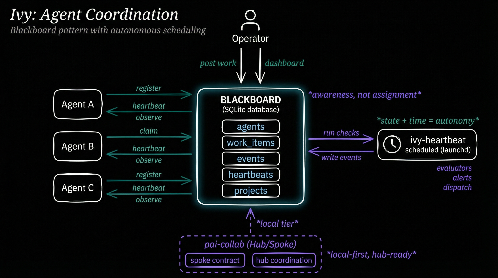

# ivy-blackboard

Local agent coordination using the blackboard pattern.

## The Idea

The **blackboard** is a coordination pattern from AI research. Instead of agents talking directly to each other, they read from and write to a shared surface. Any agent can post work. Any agent can observe what others are doing. No agent needs to know about any other agent.

This is an **awareness model, not an assignment model**. Nobody assigns work. Agents see what exists and claim what they can do.

ivy-blackboard is that shared surface -- a single SQLite file that multiple CLI agents use for coordination.

## Two Dimensions

The system is composed of two tools that handle orthogonal concerns:

**ivy-blackboard** is the *state* dimension. It knows what work exists, who is working on it, and what happened. It is a database with a CLI -- it doesn't run anything or schedule anything. It is the coordination surface.

**ivy-heartbeat** is the *time* dimension. It runs on a schedule (macOS launchd), checks a configurable set of evaluators, and acts on what it finds. It reads the blackboard, dispatches agents to available work, and writes results back. It bridges the gap between what exists and what is due.

Together they create a system where projects post work, agents claim and execute it, progress is observable, failures are recoverable, and the operator wakes up to completed features.



## How It Works

1. **Projects register their work** -- features, bugs, tasks get posted to the blackboard from any source (manual, SpecFlow, GitHub issues)
2. **A scheduler queries for available work** -- heartbeat or any scheduling agent reads the blackboard, finds unclaimed items ordered by priority
3. **Agents claim and execute** -- each agent registers a session, claims a work item, sends heartbeats with progress updates
4. **Everything is observable** -- the web dashboard, CLI, or other agents can see who is working on what, in real time via SSE
5. **Failures are recoverable** -- if an agent crashes, PID liveness checking detects the stale session and releases its claimed work back to the pool

## Part of a Larger Architecture

ivy-blackboard implements the **local blackboard** tier of a hub/spoke coordination architecture being developed in [pai-collab](https://github.com/jcfischer/pai-collab).

The full model has three layers:

| Layer | Scope | Purpose |
|-------|-------|---------|
| **Local** (ivy-blackboard) | Single machine | Agent coordination, work claiming, heartbeats |
| **Spoke** | Per-contributor | Contract schema that exposes local state to the hub |
| **Hub** (pai-collab) | Multi-contributor | Shared coordination across contributors and machines |

The local blackboard is fully functional standalone -- it doesn't require the hub. But its data model is designed so that a spoke contract can expose selected state (available work, agent status, completed items) to a shared coordination layer. The blackboard pattern scales from one developer's laptop to a distributed team without changing the core abstraction.

See [pai-collab issue #78](https://github.com/jcfischer/pai-collab/issues/78) (local blackboard proposal) and [issue #80](https://github.com/jcfischer/pai-collab/issues/80) (hub/spoke architecture) for the design discussion.

## Quick Start

```bash
bun install

# Register an agent
blackboard agent register --name "my-agent"

# Register a project
blackboard project register --id my-project --name "My Project" --path .

# Create and claim a work item
blackboard work create --id task-1 --title "Implement feature X" --project my-project
blackboard work claim task-1 --session <session-id>

# Check status
blackboard status

# Start the web dashboard
blackboard serve --port 3141
```

## Commands

| Command | Description |
|---------|-------------|
| `agent register` | Register a new agent session |
| `agent deregister` | End an agent session |
| `agent heartbeat` | Send a heartbeat with progress |
| `agent list` | List agent sessions |
| `project register` | Register a project |
| `project list` | List projects |
| `project status <id>` | Show project detail with agents and work |
| `work create` | Create a work item |
| `work claim` | Claim a work item |
| `work release` | Release a claimed work item |
| `work complete` | Mark a work item as completed |
| `work block` | Block a work item |
| `work unblock` | Unblock a work item |
| `work list` | List work items |
| `work status <id>` | Show work item detail |
| `observe` | Show event log |
| `status` | Show overall blackboard health |
| `sweep` | Detect and clean up stale agents |
| `export` | Export full state snapshot as JSON |
| `serve` | Start the web dashboard server |

All commands support `--json` for machine-readable output.

## Web Dashboard

`blackboard serve` starts a local HTTP server with:

- **REST API** at `/api/status`, `/api/agents`, `/api/work`, `/api/events`, `/api/projects`
- **SSE** at `/api/events/stream` for live event updates
- **HTML dashboard** at `/` with auto-refresh, dark theme, and agent log viewer

## Architecture

```
blackboard CLI
    |
    v
Commander.js routing (src/commands/*.ts)
    |
    v
Core modules (src/*.ts)
    |
    v
SQLite database (bun:sqlite)
```

**Database tables:** `agents`, `projects`, `work_items`, `heartbeats`, `events`, `schema_version`

**Key design decisions:**

- Single SQLite file, no network dependencies
- Transactional writes with event emission
- Automatic stale agent detection via PID liveness checking
- Content filtering (sanitizeText) on all user-supplied text fields
- 600 permissions on database file

## Configuration

Optional `blackboard.json` in the working directory:

```json
{
  "database": {
    "operatorPath": "~/.pai/blackboard/local.db",
    "projectDir": ".blackboard"
  },
  "heartbeat": {
    "intervalSeconds": 60,
    "staleThresholdSeconds": 300
  },
  "contentFilter": {
    "maxFieldLength": 500,
    "stripCodeBlocks": true,
    "stripHtmlTags": true
  }
}
```

All fields have defaults -- the config file is optional.

## Testing

```bash
bun test
```

## Stack

- **Runtime:** Bun
- **Database:** SQLite (bun:sqlite)
- **CLI:** Commander.js
- **Validation:** Zod
- **Dashboard:** Vanilla HTML/CSS/JS (no build step)

## License

MIT
