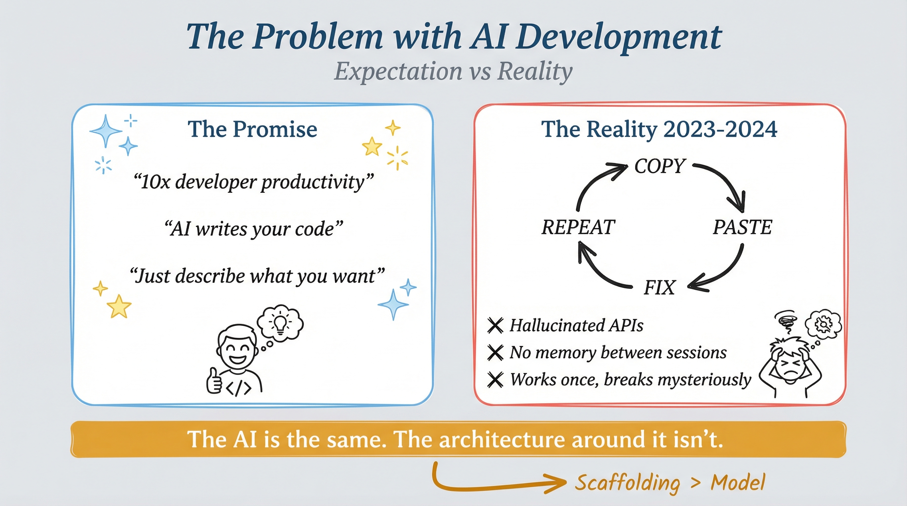
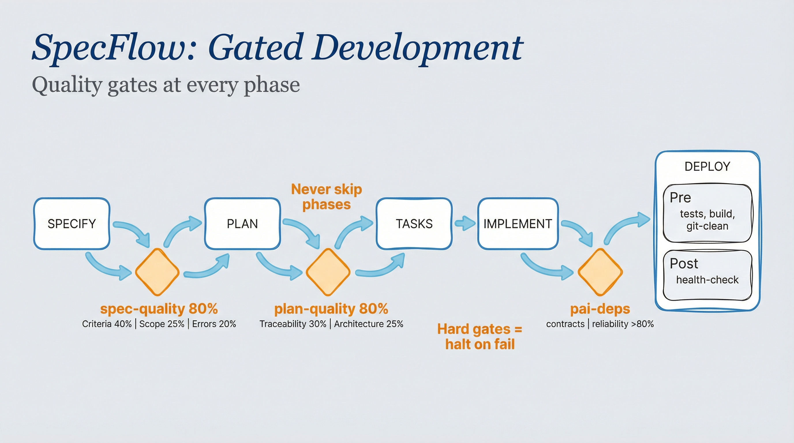

# SpecFlow Bundle

**Spec-Driven Development for AI Infrastructure**

---

## Why SpecFlow?

### The Problem

AI coding assistants promise "10x developer productivity" — just describe what you want and watch the code appear. The reality is a frustrating cycle:



**Copy → Paste → Fix → Repeat.** Hallucinated APIs. Lost context. Code that works once and breaks mysteriously. Every session starts from zero.

### The Insight

> **The AI is the same. The architecture around it isn't.**

The breakthrough isn't a better model — it's better scaffolding. When you give AI agents structure, constraints, and verification gates, they stop hallucinating and start engineering.

[Cory Doctorow articulated](https://pluralistic.net/2026/01/06/1000x-liability/) what experienced developers know: **code is a liability, not an asset**. Every line requires maintenance. Every feature adds complexity. SpecFlow forces AI through engineering discipline instead of letting it generate code freely.



### How It Works

Every feature moves through gated phases. The AI cannot skip ahead. No code gets written until the spec, plan, and tasks are complete:

```
SPECIFY → PLAN → TASKS → IMPLEMENT → COMPLETE
                                   ↘ (opt-in) HARDEN → REVIEW → APPROVE
```

| Phase | What Happens | Gate |
|-------|--------------|------|
| **SPECIFY** | Interview-driven requirements. What are we building? Why? | Human approves spec |
| **PLAN** | Architecture decisions, data models, failure modes | Human approves design |
| **TASKS** | Break work into reviewable units with dependencies | Human approves breakdown |
| **IMPLEMENT** | TDD execution with verification | Tests pass, contracts verified |
| **HARDEN** | Acceptance test generation and verification | All ATs pass |
| **REVIEW** | Evidence compilation (automated checks + ATs) | Human reads review package |
| **APPROVE** | Human approves or rejects with feedback | Human judgment |

**The result:**
- No hallucinated features — everything traces back to approved specs
- No forgotten context — database tracks all features and progress
- No mysterious breakage — dependency tracking catches cascading failures
- Resumable anytime — interrupt and pick up exactly where you left off

> *The AI does the work. You provide direction and corrections.*

---

## Quick Start

```bash
git clone --recursive https://github.com/jcfischer/specflow-bundle.git
cd specflow-bundle
bun run install.ts
```

> AI agent? See [docs/AGENT-INSTALL.md](docs/AGENT-INSTALL.md) for the full installation checklist.

---

## A Typical Session

```bash
# Start a new project
specflow init my-project
cd my-project

# Add a feature
specflow add "User authentication with JWT"
# → Creates F-1

# Work through the phases (each requires your approval before continuing)
specflow specify F-1      # AI interviews you, writes spec.md → you approve
specflow plan F-1         # AI designs the architecture → you approve
specflow tasks F-1        # AI breaks it into tasks → you approve
specflow implement F-1    # AI writes code with TDD → tests pass

# Done
specflow complete F-1

# Check overall progress
specflow status
```

That's the core loop. The AI proposes, you approve, it builds.

---

## What's Included

| Package | Purpose |
|---------|---------|
| **specflow** | Core CLI — spec-driven workflow engine |
| **specflow-ui** | Progress dashboard at `localhost:3000` |
| **pai-deps** | Dependency tracking across features |

---

## CLI Reference

### Core Workflow

```bash
specflow init my-project     # Initialize a new project
specflow add "New feature"   # Add a feature (creates F-N)
specflow status              # Check progress across all features
specflow specify F-1         # Create specification (interview-driven)
specflow plan F-1            # Create implementation plan
specflow tasks F-1           # Generate task breakdown
specflow implement F-1       # Execute with TDD enforcement
specflow complete F-1        # Mark feature complete
```

### Extended Lifecycle (opt-in)

```bash
specflow harden F-1           # Generate acceptance test template
specflow harden F-1 --ingest  # Ingest filled acceptance results
specflow review F-1           # Compile evidence package
specflow approve F-1 F-2      # Approve pending gates (batch)
specflow reject F-1 --reason "..." # Reject with feedback
specflow inbox                # Priority-ranked review queue
specflow audit                # Detect spec-reality drift
```

### Contribution Workflow

```bash
specflow contrib-prep F-1              # Full workflow (5 approval gates)
specflow contrib-prep F-1 --inventory  # Generate file inventory only
specflow contrib-prep F-1 --sanitize   # Run secret/PII scanning only
specflow contrib-prep F-1 --extract    # Extract to clean contrib branch
specflow contrib-prep F-1 --verify     # Verify contribution branch
specflow contrib-prep F-1 --dry-run    # Preview without changes
```

### Version Control (Dolt backend)

```bash
specflow dolt init --cli     # Switch to serverless Dolt CLI mode
specflow dolt status         # Show uncommitted changes and branch
specflow dolt commit "msg"   # Commit current state
specflow dolt push           # Push to remote (DoltHub)
specflow dolt pull           # Pull from remote
specflow dolt log            # Show commit history
specflow dolt diff           # Show row-level diff vs HEAD
```

### Quality & Management

```bash
specflow eval run                        # Run all applicable evals
specflow eval run --rubric spec-quality  # Run specific rubric
specflow phase F-1 implement             # Get or set feature phase
specflow revise F-1                      # Revise spec/plan/tasks artifact
specflow ui                              # Launch progress dashboard
```

### Other Tools

```bash
pai-deps health              # Show ecosystem health
pai-deps verify              # Verify all contracts
pai-deps blast-radius <tool> # Impact analysis

specflow-ui --port 3000      # Dashboard at http://localhost:3000
```

---

## Database Backends

SpecFlow defaults to SQLite (zero config). Switch to Dolt for version control:

| Backend | Use When | Requires |
|---------|----------|----------|
| `sqlite` (default) | Local solo development | Nothing |
| `dolt-cli` | Git-like VC, no server needed | `dolt` CLI |
| `dolt` (server) | Team use, DoltHub sync | Running Dolt server |

**Dolt CLI mode** stores data in `.specflow/dolt/` alongside your specs — commits travel with the repo:

```bash
specflow dolt init --cli                   # one-time setup
specflow dolt init --cli --remote org/repo # with DoltHub remote
```

---

## Architecture

```
+-------------------------------------------------------------+
|                    specflow-ui                               |
|              (Progress Dashboard)                            |
|         http://localhost:3000                                |
+----------------------------+---------------------------------+
                             | reads
                             v
+-------------------------------------------------------------+
|                    SpecFlow CLI                              |
|         specify → plan → tasks → implement                   |
|         (opt-in) → harden → review → approve                 |
+----------------------------+---------------------------------+
                             | reads/writes
                             v
+-------------------------------------------------------------+
|              Database Adapter (pluggable)                    |
|   sqlite (default) | dolt-cli (serverless) | dolt (server)  |
+----------------------------+---------------------------------+
                             | validates against
                             v
+-------------------------------------------------------------+
|                    pai-deps                                  |
|           (Dependency Registry)                              |
|   pai-deps verify | blast-radius | health                    |
+-------------------------------------------------------------+
```

---

## Collaborative Development

SpecFlow's `contrib-prep` command bridges private development with the [pai-collab](https://github.com/mellanon/pai-collab) shared ecosystem:

1. **Your Private Workspace** — Develop features in your private trunk using the full SpecFlow workflow
2. **Contrib-Prep** — Extract clean contributions through 5 human-approved gates
3. **Shared Blackboard** — Submit via fork + PR to the pai-collab coordination repo
4. **Review Pipeline** — Automated checks, community agents, human sign-off
5. **Ecosystem** — Released contributions available to all operators

> AI agents submit PRs like humans — the operator is accountable. Fork model means no write access needed.

---

## Migration from SpecKit

| Old Command | New Command |
|-------------|-------------|
| `/speckit.specify` | `specflow specify F-N` |
| `/speckit.plan` | `specflow plan F-N` |
| `/speckit.tasks` | `specflow tasks F-N` |
| `/speckit.implement` | `specflow implement F-N` |

```bash
rm -rf ~/.claude/skills/SpecKit   # remove old installation
bun run install.ts                # install this bundle
```

---

## Support

Free and open source under the MIT license.

- [Support on InVisible Store](https://projects.invisible.ch/support.html)
- [GitHub Sponsors](https://github.com/sponsors/jcfischer)
- [Product Page](https://projects.invisible.ch/specflow/)
- [InVisible GmbH](https://invisible.ch)

---

Built with 35+ years of experience in complex IT environments.
